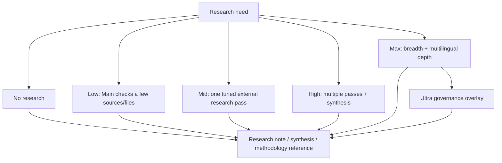
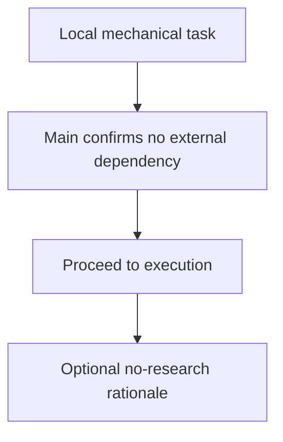
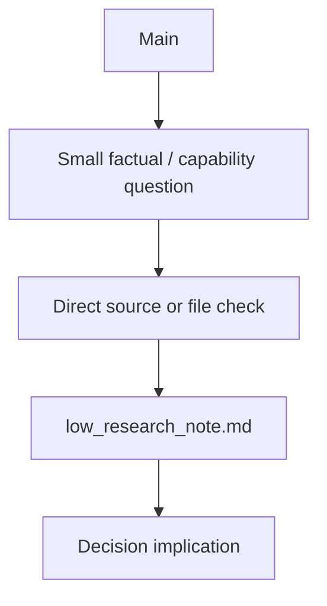
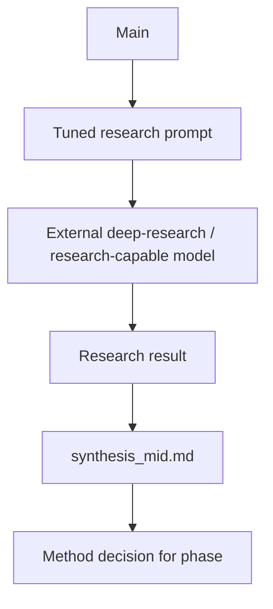
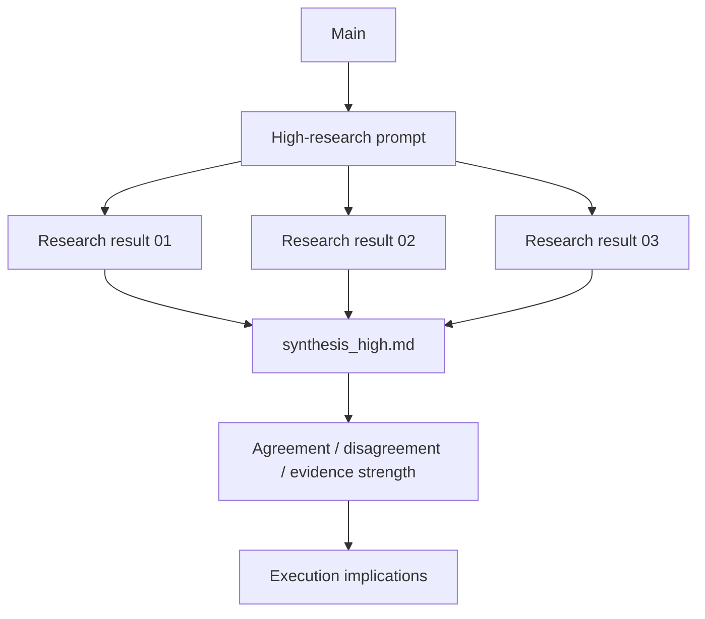
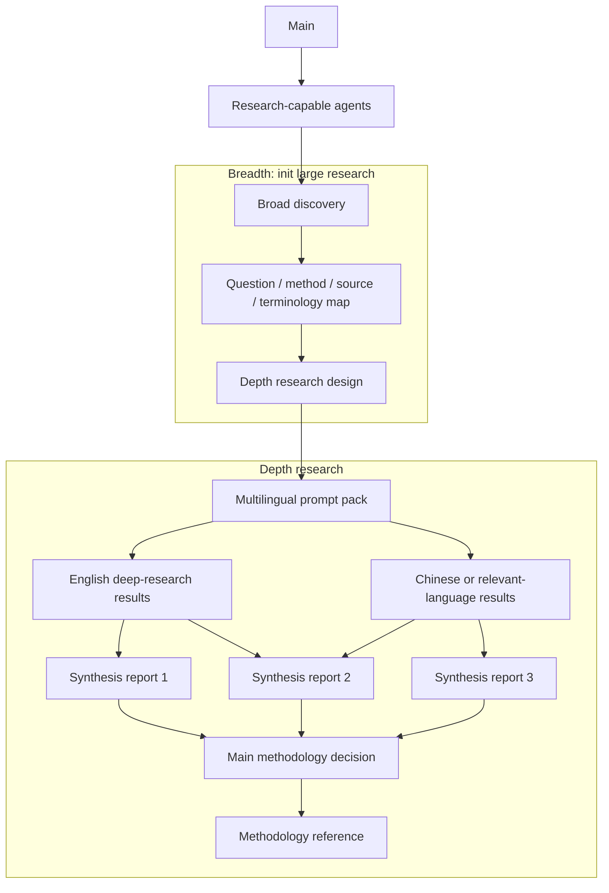
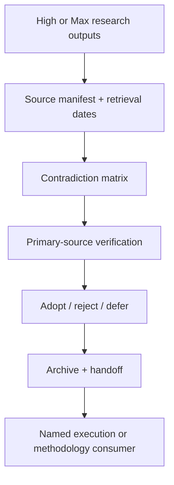

# Distribution note

> **Compatibility note (v5.6.35):** this document describes the older Goal/Structured/role surface retained for existing v5.6.31-style repositories. New long-horizon work should follow `.ai-workflow/docs/PHASE_DIC_EPS_STRUCTURE.md`, `.ai-workflow/STATE.json`, and the Main/Theory/Experiment hierarchy.


This is the complete human and maintainer guide. It is intentionally detailed and is not loaded
wholesale into ordinary Worker prompts. The machine-installable runtime lives only under
`.ai-workflow/`. Role-specific agents read the relevant `.ai-workflow/docs/*.md` file and the
active task contract. This guide, the technical report and presentation remain distribution
artifacts for planning, maintenance and training.

# AI-Native Workflow v5.6.31 — Main/Orchestrator Detailed Guideline

## Purpose

This document defines an operational standard for AI-native research, documentation, coding repositories, technical systems, quantitative projects, reports, web applications, experiments, and multi-phase build pipelines.

Version 5.6.31 is designed so the **user does not need to create, assign or coordinate execution tracks**. The user supplies objectives, constraints, priorities, corrections and approvals. **Main** is the intent architect and authority guardian. **Orchestrator** is the runtime controller that determines readiness, generates full prompts, assigns economical Workers, integrates evidence, repairs recoverable failures and invokes independent verification.

This replaces the earlier tendency to combine intent interpretation, runtime routing and code execution inside one Main context. The repository remains the durable source of truth, and the short `aw` CLI performs deterministic scaffolding, lifecycle, checklist, Minor and validation operations.

v5.6.31 separates five independent dimensions:

- **mode** — Goal or Structured, determining whether Goal Mode lets Orchestrator create the Execution Prompt Stack (EPS) after approval from current repository evidence; Structured Mode freezes Main-authored Durable Intent Contracts (DICs) and Execution Prompt Stack (EPS) before approval;
- **execution level** — low, mid, high, xhigh or ultra, determining governance, recovery and verification;
- **research level** — none, low, mid, high or max, determining external investigation and synthesis;
- **test profile** — focused, affected, integration or full, selected by risk rather than ceremony;
- **routing profile and model availability** — `all`, `chatgpt_only`, `claude_only` or `custom`, resolved against user-declared models and surfaces.

A phase may use XHigh execution with no external research, High research with Mid execution, or reserve GPT-5.6 Pro for only Main and independent verification while routing repository work to Sonnet/Terra-class agents.

## Companion files

Human-facing distribution files:

```text
AI_NATIVE_WORKFLOW.md
DETAILED_WORKFLOW_GUIDE.md
GUIDE_ULTRA.md
WORKFLOW_CLI.md
QUICKSTART.md
MIGRATION.md
maintenance/
```

Machine-facing files live under `.ai-workflow/docs/`, including dedicated Main, Orchestrator, Worker, Verifier, Minor, Researcher, Prompting, Model, Next-Phase, Configuration, CLI, Ultra and execution-level guides. Full templates live under `.ai-workflow/aw/templates/`. The runtime intentionally does not include one universal audit prompt; verification is generated from the active contract.

---


## 1. Core Operating Principle

The workflow separates **intent authority** from **runtime orchestration**. The user defines the
objective, constraints, corrections and consequential approvals. **Main** converts that intent into
a durable acceptance contract. **Orchestrator** converts the approved contract into bounded
execution prompts, assigns economical Workers, integrates evidence, repairs recoverable defects and
invokes independent verification. **Worker** and **Minor** execute, while **Verifier** decides
whether acceptance is met.

```text
User
  -> Main: intent match / acceptance / authority / mode / closure
  -> Orchestrator: readiness / prompt generation / model routing / integration
  -> Worker or Minor: bounded execution
  -> Verifier: independent evidence and checklist completion
  -> Main: material adjudication or final handoff
```

Main and Orchestrator may be instantiated by one underlying model, but they must remain distinct
contexts and authority roles. Combining them in one undifferentiated context encourages Main to
spend attention on terminal noise, encourages Orchestrator to reinterpret user intent during
execution, and makes approval boundaries difficult to audit.

### 1.1 Durable state

Durable state belongs in the repository: root routing, workflow config, phase contract, prompt
registry, append-only events, logs, artifacts, verification and final handoff. Chat memory may
accelerate work but is never the only authority. A fresh session should reconstruct the state by
reading files and `aw status`.

### 1.2 Modes

**Goal Mode** is the default adaptive path. Main writes one complete `GOAL.md`; after exact GO, `aw go` materialises acceptance-bearing `REQUESTS.md`, and Orchestrator creates the Execution Prompt Stack (EPS) from approved GOAL.md and current repository evidence. **Structured Mode** adds a complete plan,
architecture and advance prompt graph when coupling, risk or scientific validity requires it. Goal
Mode is not a shallow prompt; it defers route generation, not prompt quality.

### 1.3 Execution and research levels

Execution uses `low`, `mid`, `high`, `xhigh`, `ultra`. Research uses `none`, `low`, `mid`, `high`,
`max`. Select them independently. XHigh replaces the earlier execution label Max; Max remains a
research label because breadth/depth of evidence is different from execution consequence.

### 1.4 Tool independence and economy

The repository remains operable without optional plugins, MCPs, memory systems or subagent
mechanisms. The workflow uses capability profiles and assigns the cheapest likely-to-pass model to
bounded work. Deterministic state changes belong in `aw`; semantic choices remain with Main or
Orchestrator. Long terminal output may be compressed only when raw decisive evidence remains
recoverable.

ides a decisive failure.

---


## 2. Role and Authority Model

### 2.1 Main — Intent Architect and Authority Guardian

Main preserves rough user input, reads existing evidence, resolves material ambiguity, defines
request IDs and acceptance, selects mode and levels, freezes authority/stop boundaries, records GO,
adjudicates material amendments and closes or creates the next phase. Main does not default to
product-code execution, terminal monitoring or mechanical prompt writing.

Main uses a short intent-elicitation pass only when an unanswered question changes user-visible
scope, acceptance, permissions, cost, external action, evidence or release status. It reads files
before asking. When exact GO is already supplied, it records it and hands control to Orchestrator
immediately unless a named critical blocker is known.

### 2.2 Orchestrator — Runtime Controller

Orchestrator recomputes dependency readiness, generates or consumes full prompt contracts, routes
work to economical Workers, runs file-disjoint siblings when safe, integrates every return, creates
bounded repairs, records supersession, invokes Verifier and continues automatically after GO.
Orchestrator cannot invent a materially new objective, relax acceptance or infer external authority.

### 2.3 Researcher

Researcher owns source discovery, primary-source verification, comparative synthesis and explicit
uncertainty for a named decision. Main consumes the result. Research never proves implementation.

### 2.4 Worker

Worker executes one bounded prompt, edits only authorized paths, runs required checks, preserves
failures and returns evidence. It does not advance the phase or mark requests complete.

### 2.5 Verifier

Verifier independently compares source, runs and artifacts with the contract. Only Verifier marks
`REQUESTS.md` items complete through `aw request verify`. It writes verification evidence but does
not repair product files.

### 2.6 Minor

Minor is a first-class, economical **phase-local** lane for routine fixes, updates and reports.
Every phase uses `phases/<phase>/minor/`; root/custom/standalone Minor locations are not part of
v5.6.31. Minor preserves exact rough input, uses request-specific GO when configured, writes one
log and escalates architecture, dependency, behavior, data, science, permission, release or
acceptance changes through `aw minor promote`.

### 2.7 Capability profiles

| Role | Default | Escalation condition |
|---|---|---|
| Main | frontier | already highest; reduce only for trivial intake |
| Orchestrator | balanced | architecture/high consequence/repeated failure |
| Worker | economy | cross-file ambiguity or difficult debugging |
| Complex Worker | balanced | frontier only when necessary |
| Minor | economy | escalate out of Minor rather than merely increasing model |
| Verifier | frontier-independent | material phases require fresh context/model where feasible |
| Researcher | research-specialist | multilingual/high-stakes evidence |

Actual provider/model/effort/permissions should be recorded when exposed by the platform.

ENT_MODEL_SELECTION.md`.

---


## 3. Instruction Architecture

### 3.1 One machine root

Only `.ai-workflow/` is installed into a live repository. It contains `aw`, configuration, machine
role guides, execution-level guides, full templates and tests. Human guides, report and slides stay
outside the machine root in the distribution.

```text
.ai-workflow/
  aw.py
  aw/
  config.toml
  docs/
    MAIN.md ORCHESTRATOR.md WORKER.md VERIFIER.md MINOR.md RESEARCH.md
    PROMPTING.md MODELS.md NEXT_PHASE.md CONFIGURATION.md CLI.md ULTRA.md
    execution_levels/
  tests/
```

The earlier four hidden roots are migration inputs, not active dependencies.

### 3.2 Stable and task-local layers

Root `AGENTS.md` and `agent.manifest.yaml` route agents to the current phase and machine guides.
Stable role/model/evidence policy lives in `.ai-workflow/docs/`. Task-local semantics live in
phase documents and prompts. Main and Orchestrator must not load every human guide into every
Worker context.

### 3.3 Full templates

Structured Mode copies a complete template set into `phase/templates/` by default. Templates are
intentionally repetitive: a fresh Worker should receive role, root, rough input, dependencies,
paths, outputs, checks, evidence, recovery and stop conditions without relying on hidden chat
context. Goal Mode also uses these full templates when Orchestrator generates the next prompt.

### 3.4 Repository-root configuration

The config supports `auto`, `fixed`, `environment` and `cwd` root modes. The resolved root is
inserted into init and generated prompts by default. Agents still run `aw root show` before work.
A phase records its root metadata and every safe prompt carries a managed context hash.

### 3.5 Configuration-synchronised initialization and updates

`aw init` is the normal installation-time entry point. It reads `.ai-workflow/config.toml` and
`.ai-workflow/package.json`, creates root routing controls, and may create the first Goal or
Structured phase with mode, execution/research/test levels, routing profile, repository root,
declared available models and agent surfaces embedded in the initialization prompts.

Example:

```bash
aw init --project-name "Project" --phase phase_01_goal --mode goal \
  --routing-profile all \
  --available-model gpt-5.6-pro \
  --available-model claude-sonnet-4.6 \
  --surface chatgpt --surface claude_code
```

After changing configuration, model availability, root or surfaces, run:

```bash
aw update
aw validate
```

The update replaces only generated managed-context blocks/frontmatter in safe (`planned` or
`ready`) prompts by default. Terminal prompts are historical evidence and are skipped unless
`--include-frozen` is explicitly used. `aw status --full` shows current mode, root, routing,
available models, test profile and stale prompt contexts.

---


## 4. Repository and Phase Structure

### 4.1 Distribution

```text
AI_Native_Workflow_v5.6.31/
  .ai-workflow/                    # only machine-install directory
  AI_NATIVE_WORKFLOW_TECHNICAL_REPORT.pdf/.tex
  README.md QUICKSTART.md VERSIONING.md PACKAGE_MANIFEST.json
```

Presentation-development materials are maintained outside the final distribution and are not
covered by `PACKAGE_MANIFEST.json`.

### 4.2 Live repository

```text
AGENTS.md
agent.manifest.yaml
.ai-workflow/
phases/
  phase_xx_name/
```

### 4.3 Goal phase

Before GO:

```text
GOAL.md
README.md
logs/ reports/ artifacts/ verification/ minor/
```

In Goal Mode there is no numbered initialization-prompt handoff. The approved `GOAL.md` directly initializes Orchestrator. Orchestrator then creates richer operational Durable Intent Contracts (DICs), builds the Execution Prompt Stack (EPS) from current repository evidence, executes the Execution Prompt Stack (EPS), integrates evidence, and invokes Verifier.

### 4.4 Structured phase

Adds full `PLAN.md` and `ARCHITECTURE.md`, plus any research structure. The template copies are
operational files, not optional toy examples.

### 4.5 Requests

Requests are Markdown checklist items with IDs and Acceptance lines. Only Verifier checks them.
Verifier events are append-only and must link evidence. Reopened items are unchecked.

### 4.6 Reports

Human reports are allowlisted and limited. Raw logs, metrics, source matrices, checkpoints and
packages stay in appropriate machine evidence folders. This prevents report proliferation from
becoming a second inconsistent state system.

ke a phase appear more rigorous.

---

## 5. Prompt Graph and Naming Standard

### 5.1 Prompt graph principle

The phase Execution Prompt Stack (EPS) is a dependency graph, not a list of permanent workers.

Every substantial prompt should have:

- a unique prompt ID;
- a clear objective;
- declared dependencies;
- allowed and forbidden paths;
- completion evidence;
- a log or report destination;
- stop and escalation conditions.

### 5.2 Prompt ID ranges

Recommended ranges:

| Range | Purpose |
|---|---|
| `000` | Main phase bootstrap. |
| `00–09` | Inspection, inventory, archive, setup, and preparation. |
| `10–69` | Primary implementation, research, analysis, drafting, or experiment work. |
| `70–79` | Documentation, migration, packaging, and release preparation. |
| `80–89` | Integration, reconciliation, periodic control review, and pre-verification checks. |
| `90` | Independent verification. |
| `91–98` | Verification-driven repairs, rechecks, and closure actions. |
| `99` | Main handoff, compact state, next-phase recommendation. |

The ranges are conventions rather than a hard workflow engine.

### 5.3 Letter suffixes

Letter suffixes identify sibling work packages:

```text
prompt_03A_implement_data_layer.md
prompt_03B_implement_cli_layer.md
prompt_03C_update_documentation.md
```

Interpretation:

- all are peers at the same broad stage;
- they may share the same prerequisite;
- they may be delegated concurrently when safe;
- they do not correspond to permanent agent identities;
- they may be executed by the same or different subagents;
- they must not be assumed parallel if their paths or interfaces overlap.

### 5.4 Prompt filename rules

Use:

```text
prompt_<ID>_<lowercase_slug>.md
```

Examples:

```text
prompt_000_orchestrator_init.md
prompt_00_inventory_repo.md
prompt_03A_implement_cli.md
prompt_80_integrate_outputs.md
prompt_90_verify.md
prompt_99_handoff.md
```

Prompt IDs must be unique within the phase.

### 5.5 Prompt registry

The phase `README.md` should contain a prompt registry:

| Prompt | Objective | Depends on | Allowed paths | Required evidence | Status |
|---|---|---|---|---|---|
| `000` | Initialise Main | none | read-only plus phase docs | orchestration status | ready |
| `00` | Inventory repository | `000` | read-only | inventory report | blocked |
| `01` | Archive legacy structure | `00` | `Archive/**` | archive manifest | blocked |
| `03A` | Implement CLI | `02` | CLI and validation | command and smoke evidence | blocked |
| `03B` | Rewrite prompt architecture | `02` | prompt docs | consistency check | blocked |
| `80` | Integrate work | `03A`, `03B` | declared integration files | integration log | blocked |
| `90` | Verify phase | `80` | read-only plus verification | verification report | blocked |
| `99` | Prepare handoff | `90` or approved repair | reports and handoff | compact state | blocked |

Status values should be simple:

```text
planned
ready
running
blocked
completed
failed
superseded
```

### 5.6 Prompt metadata

A concise metadata header is recommended:

```yaml
---
prompt_id: 03A
title: Implement workflow CLI
depends_on:
  - "02"
allowed_paths:
  - aw
  - .ai-workflow/aw/**
  - tests/test_component.py
forbidden_paths:
  - Archive/**
risk: medium
validation:
  - python -m pytest tests/test_component.py -q
log_path: phases/phase_02_refactor/logs/prompt_03A_implement_cli.md
---
```

Metadata should support discovery and validation. It should not duplicate the full prompt body.

---


## 6. Phase Protocol

### 6.1 Creation

```bash
aw phase init phase_01_name --mode goal --execution-level low --rough-input "..."
aw phase init phase_02_name --mode structured --execution-level high \
  --research-level mid --from-handoff phases/phase_01_name/reports/FINAL_HANDOFF.md
```

Structured Mode creates architecture and copies full templates by default. `--no-architecture` or
`--no-copy-templates` must be deliberate exceptions.

### 6.2 Goal initialization

Goal Mode is initialized by `GOAL.md`, not by a numbered Main/Orchestrator prompt pair. Main writes the goal contract; the human reviews and approves it; the approved goal directly initializes Orchestrator. Orchestrator then creates the operational Durable Intent Contracts (DICs) and Execution Prompt Stack (EPS) from the live repository context.

### 6.3 GO and immediate handoff

`aw go` records approval and scope. In Goal Mode it marks `GOAL.md` ready as the Orchestrator initialization contract. In Structured Mode it validates the richer Durable Intent Contract (DIC) package and prepared Execution Prompt Stack (EPS). Checkbox changes by Verifier do not alter the intent scope hash; material GOAL/PLAN/ARCHITECTURE/EXECUTION_CONTRACT changes do.

### 6.4 Orchestrator initialization

In Goal Mode, Orchestrator starts from approved `GOAL.md`, creates the richer operational Durable Intent Contracts (DICs) and Execution Prompt Stack (EPS), and begins the automatic execution loop. In Structured Mode, Orchestrator starts from the Main-authored Durable Intent Contract (DIC) package and Execution Prompt Stack (EPS), validates readiness, and executes the approved graph.

### 6.5 Append-only changes

Use `aw phase append` for user updates and explicit supersession for defective prompts. Do not
silently rewrite executed history. A material change after GO requires a new scoped approval.

### 6.6 Handoff and next phase

The final handoff states exact completed/partial/blocked work, identities, caveats, release status
and next trigger. `aw phase plan-next` generates a hash-bound proposal; `--create` may initialize the
next phase with mode, levels, architecture, templates, rough input, handoff and approval phrase.

t Main must read first.

---


## 7. Orchestrator Runtime Loop

### 7.1 Readiness

A prompt is ready only when all dependencies satisfy the configured done state, exact approval is
present, required inputs/permissions exist and no critical blocker is open. `aw next` reports
structural readiness; Orchestrator also evaluates semantic safety.

### 7.2 Prompt generation

Use complete prompt metadata and body. Goal Mode generates one next prompt; Structured Mode may
freeze graph nodes in advance. Every required output must fit allowed paths. Validate before
dispatch.

### 7.3 Delegation and model routing

Choose the cheapest sufficient profile. Prefer economy for deterministic work, balanced for
cross-file implementation and frontier for high ambiguity/consequence or independent verification.
Do not use multi-agent work merely to create activity.

### 7.4 Parallelism

Run siblings concurrently only when dependencies, writes and recovery are independent. One owner
per file. Main/Orchestrator integrates siblings before downstream work.

### 7.5 Collection and integration

Read the return, inspect source and decisive artifacts, reject incomplete evidence, run integration
checks, update lifecycle and recompute readiness. A subagent return is not integrated merely because
it exists.

### 7.6 Repair and supersession

Recoverable defects receive bounded repairs. Prompt-contract defects receive a replacement ID via
`aw prompt supersede`; downstream dependencies wait for the replacement. Preserve failed attempts.

### 7.7 Stop policy

Continue automatically after GO. Stop only for invalid evidence/safety, missing authority,
credentials, external/destructive/costly action, release/submission or material change to
acceptance. Stop the affected branch rather than globally halting independent work.

tion control loop.

---


## 8. Execution Protocol and Levels

### 8.1 Common execution contract

Every Worker prompt contains repository root, role and level guides, rough input, interpretation,
request IDs, dependencies, paths, outputs, checks, evidence, recovery, stop rules and return. A
complex prompt may be repetitive so it is self-contained.

### 8.2 Low

One small reversible task. Goal Mode, one Worker/Minor, one deterministic check, concise evidence.
Do not create architecture/research/multi-agent ceremony.

### 8.3 Mid

Several related files or one coherent feature. Small graph or Execution Prompt Stack (EPS) sequence, compatibility plan,
focused tests plus integration, one independent verification pass.

### 8.4 High

Multiple work packages, data/model/package/manuscript integration, measured resource preflight,
clean smoke, independent verification and bounded repair.

### 8.5 XHigh

Broad/high-consequence multi-stage execution. Comprehensive Structured contract, staged gates,
complete package, periodic Main reviews, repeated verification and final compact handoff. XHigh is
the v5.6.31 execution-governance successor to the old Max label.

### 8.6 Ultra

High/XHigh with strongest authority, rollback, private data, provenance, security, external action,
release and recovery control. Ultra does not mean largest models for every task.

### 8.7 Evidence progression

```text
planned -> implemented -> import-tested -> smoke -> pilot -> locked -> independently verified
```

No implicit promotion. Preserve failures and resource telemetry. Render visual artifacts and test
packages in clean environments when those claims are made.

### 8.8 Role-specific guides

Read `.ai-workflow/docs/execution_levels/<LEVEL>.md` and role guides rather than reloading this full
manual into every Worker context.

 not yet written.

---

## 9. Research Protocol

Research is not automatically large. It is activated according to uncertainty, factual dependency, theoretical depth, and cost of error.

This section deliberately restores the original research framing: research is a separate scale decision from execution. Research can justify a method choice, but execution logs, tests, changed files, and artifacts are still needed to prove that the method was actually implemented.

### 9.1 Research mode table

| Mode | Meaning | Use when | Output |
|---|---|---|---|
| **No research** | Skip research. | Mechanical, reversible, local task. | None, or one paragraph rationale in `PLAN.md`. |
| **Low research** | Main researches directly or inspects a small number of sources or files. | One current fact, small capability check, quick comparison, or tool-policy clarification. | `low_research_note.md`. |
| **Mid research** | A research-capable model or external deep-research agent runs one tuned pass. | Several plausible methods; architecture depends on a sourced recommendation. | Research prompt, research result, `synthesis_mid.md`. |
| **High research** | Multiple independent research passes plus synthesis. | Theory-heavy, benchmark-heavy, paper-heavy, policy-heavy, or disagreement-prone work. | `result_01.md`, `result_02.md`, `result_03.md`, `synthesis_high.md`. |
| **Max research** | Breadth discovery, multilingual depth research, multiple syntheses, Main methodology decision. | Durable methodology reference with multilingual or cross-source disagreement risk. | Actual report / methodology reference. |
| **Ultra research governance** | Max or High research with stronger provenance, auditability, contradiction tracking, and handoff. | Research will support a high-consequence decision, release, paper, migration, or durable methodology. | Max outputs plus source manifest, contradiction matrix, decision log, archive, and consuming prompt. |

The older names `light`, `standard`, and `large` map to the current scale names as follows:

| Older name | Current scale name | Meaning |
|---|---|---|
| Light research | Low research | Main-led quick research. |
| Standard research | Mid research | One tuned research pass. |
| Large research | High research | Multiple passes plus synthesis. |
| Max research | Max research | Breadth + depth + multilingual synthesis. |

### 9.2 Research decision graph



### 9.3 No research

Use when:

- the task is mechanical;
- the output standard is already known;
- no current facts or external evidence are needed;
- the change is reversible;
- the task is mostly formatting, naming, extraction, or local code/document update.

Output: none, or one short rationale in `PLAN.md`.



### 9.4 Low research

Low research means **Main researches directly** or inspects a small number of known sources or files.

Use when:

- the question needs a current fact, tool capability check, or small comparison;
- one short source-grounded answer is enough;
- the research result is not a long-term methodology foundation;
- the cost of a wrong answer is modest;
- the answer will immediately inform the phase triad or a small edit.

Output:

```text
phases/<phase>/research/reports/low_research_note.md
```

Expected content:

- core answer;
- source notes or citations where relevant;
- decision implication;
- whether further research is needed.



### 9.5 Mid research

Mid research means **one tuned research pass** by a research-capable model, external deep-research agent, or specialist source-inspection worker.

Use when:

- the topic has several plausible methods;
- architecture depends on a research choice;
- external documentation matters;
- the phase needs a method recommendation rather than a simple fact;
- one well-scoped research result is likely sufficient.

Output:

```text
phases/<phase>/research/prompts/research_prompt_mid.md
phases/<phase>/research/reports/research_result_mid.md
phases/<phase>/research/synthesis/synthesis_mid.md
```



Mid research synthesis should answer:

```text
What was investigated?
What sources or evidence were used?
What are the viable approaches?
What is the recommended approach?
What assumptions remain uncertain?
How should execution change because of this research?
```

### 9.6 High research

High research means **several independent research passes plus comparative synthesis**.

Use when:

- one research pass may be biased or incomplete;
- the topic is theory-heavy, benchmark-heavy, policy-heavy, or method-choice-heavy;
- the project may become a paper, serious report, durable methodology, or important technical system;
- the user needs a comparison between multiple paths;
- disagreement between sources is likely.

Recommended structure:

```text
phases/<phase>/research/prompts/research_prompt_high.md
phases/<phase>/research/reports/research_result_01.md
phases/<phase>/research/reports/research_result_02.md
phases/<phase>/research/reports/research_result_03.md
phases/<phase>/research/synthesis/synthesis_high.md
```



High research synthesis should explicitly compare:

- agreements;
- disagreements;
- evidence strength;
- implementation implications;
- risk of overfitting to sources;
- what should and should not enter the phase plan.

### 9.7 Max research

Max research is a multilingual, multi-model research and synthesis stack. It must separate **Breadth** from **Depth**.

#### Breadth: init large research

The breadth stage is a large-research-style broad brainstorming and discovery stage. It happens before the actual multilingual research passes. It should identify:

- subquestions;
- candidate method families;
- likely source families;
- English, Chinese, and other relevant terminology differences;
- evaluation criteria;
- possible disagreements;
- failure modes;
- implementation implications;
- what the actual depth prompts must ask.

Output:

```text
phases/<phase>/research/prompts/research_prompt_breadth.md
phases/<phase>/research/reports/breadth_discovery.md
phases/<phase>/research/reports/depth_research_design.md
```

#### Depth research

The depth stage runs the actual multilingual research and synthesis stack:

- English deep-research prompt;
- Chinese deep-research prompt where the source base may differ materially;
- other relevant-language prompts when jurisdiction, terminology, or source availability requires them;
- English synthesis prompt;
- Chinese or language-specific synthesis prompt where relevant;
- more than two independent outputs per material language where feasible;
- three comparative synthesis reports;
- Main final report or methodology reference.

Use only when:

- the topic is central to the project;
- the phase has paper-level, theory-level, policy-level, or high-cost consequences;
- multilingual or cross-source evidence may differ materially;
- the result will become a durable methodology reference.



The three synthesis reports should not merely summarize. They compare disagreements, extract reusable methodology, identify implementation implications, and separate high-confidence conclusions from speculative claims.

### 9.8 Ultra research governance

Ultra research uses High or Max research structure and adds stronger evidence governance. It is appropriate when the research will support a high-consequence decision, release, migration, benchmark, paper, methodology, or handoff.

Ultra research adds:

- versioned source manifest;
- retrieval dates and source-access notes;
- contradiction matrix;
- confidence and uncertainty labels;
- independent model families or research surfaces where practical;
- primary-source verification for decisive claims;
- adoption, rejection, and deferral decisions;
- archive and handoff artifacts sufficient for later reproduction.



### 9.9 Research evidence rules

All research levels must separate:

```text
source fact
source interpretation
model inference
implementation recommendation
open uncertainty
```

Research outputs should not be treated as implementation evidence. Research can justify a method choice, but execution logs, tests, diffs, and changed files prove whether the method was actually implemented.

### 9.10 Research integration

Research should have a named consumer:

```text
research synthesis
  -> Main methodology decision
  -> phase contract update
  -> specific implementation or verification prompt
```

Research with no named consumer should not be accumulated merely because it might be useful later.

---

## 10. First-Class Minor Protocol

### 10.1 Purpose and location

Minor absorbs routine, reversible work without contaminating Main/Orchestrator context. Configure
`phase`, `root` or `custom` location and `auto`, `request`, `phase` or `none` approval. Phase metadata
freezes the chosen location.

### 10.2 Classes

- `MF` MinorFix: local defect;
- `MU` MinorUpdate: index/status/manifest synchronization;
- `MR` MinorReport: concise report from existing evidence.

### 10.3 Intake and prompt

Preserve rough input, write a separate bounded interpretation, list files/checks and generate a full
sample with `aw minor sample`. The prompt includes role, repository root, read-first list, exact GO,
allowed/forbidden scope, validation and closure command.

### 10.4 Approval and execution

Standalone or request-mode Minor must wait for exact `GO MinorFix NN`, `GO MinorUpdate NN` or
`GO MinorReport NN`. Phase-mode may inherit phase GO. Execute only named files, write one log and
close with `aw minor done`.

### 10.5 Escalation

Architecture, dependencies, interface/behavior, data/science, experiment, permission, external
operation, release, acceptance and evidence changes leave Minor. Do not merely use a larger model to
force an architectural task through the Minor lane.

### 10.6 Append-only integrity

Events preserve proposal, notes, approval and terminal state. Status commands do not initialize a
missing lane. Completion requires evidence/log path and named check.

tion or escalation event.

---

## 11. Verification and Logging

### 11.1 Independent verification

`prompt_90_verify.md` should be read-only except for verification outputs.

Verifier receives:

```text
REQUESTS.md
PLAN.md
README.md
PHASE_ARCHITECTURE.md if present
prompt graph and metadata
per-prompt logs
integration log
changed files and diffs
test and build outputs
research synthesis if relevant
minor/REQUESTS.md and Minor logs
known caveats
```

### 11.2 Verification output

Write:

```text
verification/verification_report.md
```

The report should include:

- requirement-by-requirement verdict;
- prompt completion and dependency check;
- changed-file scope check;
- implementation status;
- tests and smoke results;
- evidence quality;
- integration consistency;
- research-to-implementation traceability;
- Minor approval and append-only check;
- CLI validation result where relevant;
- severity-labelled findings;
- exact repair prompts;
- phase completion decision.

### 11.3 Evidence distinctions

Verification must distinguish:

```text
implemented vs claimed
configured vs executed
tested vs imported only
smoke-tested vs fully tested
sample evidence vs complete evidence
local evidence vs official evidence
fallback or proxy vs real method
file created vs file integrated
package built vs package inspected
cache written vs cache hit demonstrated
research recommendation vs implementation evidence
Minor proposed vs Minor approved
Minor approved vs Minor completed
prompt ready vs prompt executed
subagent returned result vs Main integrated result
```

### 11.4 Repair prompts

When verification fails, create bounded repair prompts:

```text
prompt_91_fix_<issue>.md
prompt_92_recheck_<issue>.md
```

Repair prompts should cite the verifier finding, affected paths, required check, and completion evidence.

### 11.5 Logging guideline

Use `.ai-workflow/docs/LOGGING.md` only when a durable implementation log, evidence record, or handoff is needed. It defines a compact log schema and closing check; it is not a reusable prompt and does not require formal independent verification for routine work.

When independent verification is justified, Main should generate `prompt_90_verify.md` from the active `REQUESTS.md`, `PLAN.md`, architecture, changed files, and acceptance criteria. This keeps verification phase-specific instead of injecting a generic audit contract into every run.

---

## 12. Compacting, Memory, and Handoff

### 12.1 Compact after milestones

Compact after:

- a substantial phase;
- a major integration point;
- a completed research stack;
- a verification cycle;
- a major context or session boundary.

Do not compact after every trivial prompt.

### 12.2 Compact state

Recommended output:

```text
reports/compact_state.md
prompts/prompt_99_handoff.md
```

Compact state should include:

- project and phase objective;
- completed prompt IDs;
- failed or superseded prompts;
- changed files;
- tests and evidence;
- binding decisions;
- architecture state;
- research conclusions;
- Minor ledger summary;
- unresolved blockers;
- tool and model assumptions;
- verification status;
- next action;
- required reading order for the next Main.

### 12.3 Memory layers

Persistent memory may support continuity, but it is not audit-grade evidence.

Use memory for:

- recalling prior decisions;
- locating old phases and logs;
- reducing repeated context uploads;
- resuming long-running work.

Before making important claims, verify memory against repository files, logs, command output, or artifacts.

### 12.4 Handoff gate

A phase is ready for handoff when:

- all required prompts are completed or explicitly superseded;
- integration is complete;
- verification blockers are resolved or clearly accepted;
- Minor requests are closed, deferred, or escalated;
- compact state matches the repository;
- the next Main has an unambiguous reading order and next action.

---


## 13. `aw` CLI and Repository Configuration

### 13.1 Purpose

`aw` performs deterministic scaffolding, state transitions and validation. It does not choose
architecture, research findings or scientific acceptance.

### 13.2 Root

```bash
aw root show
aw root set D:/Projects/Repo
aw root auto
aw root env --name AW_REPO_ROOT
```

Config supports `auto`, `fixed`, `environment`, `cwd`. Resolved root is inserted into prompts by
default, but every agent still verifies it.

### 13.3 Core commands

```bash
aw status
aw go
aw next
aw validate
aw phase init ...
aw phase plan-next ... --create
aw request add/list/verify/block/reopen
aw prompt add/list/next/set/supersede
aw minor init/add/show/note/approve/done/status/sample
aw config show/set
aw migrate --dry-run/--execute
```

### 13.4 Safety

CLI operations use containment, atomic writes where applicable, ID collision checks, append-only
events and actor restrictions. Status commands are read-only. Required outputs are validated
against allowed/forbidden paths. Verifier-only request completion is enforced.

### 13.5 Migration

`aw migrate` moves old hidden workflow roots into `.ai-workflow/legacy/v5.6.15/` rather than
deleting them. Human guides are retained in distribution `guides/`, not installed as extra hidden
roots.

lives in `guides/WORKFLOW_CLI.md`.

---

## 14. Tool and Model Surface Separation

### 14.1 General rule

Do not treat ChatGPT, Codex, Claude Code, Claude chat, APIs, IDE agents, plugins, skills, or MCPs as interchangeable.

Each project should record:

```yaml
surface:
model_id:
model_family:
reasoning_or_effort:
subagent_support:
parallel_tool_support:
permissions:
sandbox:
context_limit:
tested_version:
known_caveats:
```

### 14.2 Main versus subagent surfaces

Main benefits from:

- strong planning and synthesis;
- large context;
- reliable tool orchestration;
- direct access to phase files;
- ability to inspect subagent results;
- high-quality verification judgement.

Subagents benefit from:

- isolated context;
- bounded tool access;
- narrower prompts;
- lower-cost models for mechanical work;
- independent permissions and logs where supported.

### 14.3 OpenAI-family and Claude-family guidance

Family-specific prompting lives in `SUBAGENT_PROMPTING.md`.

Family-specific model selection lives in `SUBAGENT_MODEL_SELECTION.md`.

Do not assume that one family's prompt syntax, effort control, agent configuration format, or delegation semantics transfers directly to another.

---

## 15. Model and Prompt Evaluation

### 15.1 Do not rewrite working prompts blindly

When migrating models or prompt architecture:

1. preserve a working baseline;
2. run representative cases;
3. remove repeated or obsolete scaffolding incrementally;
4. add only targeted instructions that fix measured failures;
5. compare quality, evidence, calls, tokens, latency, and cost;
6. record the tested configuration.

### 15.2 Evaluation set

Maintain representative cases for:

- simple local edits;
- ambiguous architecture work;
- read-heavy exploration;
- write-heavy implementation;
- multi-file integration;
- research synthesis;
- verification;
- Minor request approval;
- prompt dependency handling;
- CLI append and validation.

### 15.3 Model escalation

Escalate model or reasoning level only when:

- the current result fails a defined acceptance criterion;
- ambiguity or integration risk is material;
- verification requires deeper reasoning;
- the task cannot be safely decomposed further;
- a stronger model provides measured improvement.

Do not assign the strongest model to every subagent by default.

---


## 16. Full Templates and Prompt Construction

### 16.1 Template policy

The distribution ships full templates for Main, Orchestrator, Worker, Verifier, Researcher, Minor
and next-phase generation. Structured Mode copies them into the phase by default. Repetition is
intentional: a fresh agent must not depend on invisible chat context for root, scope, evidence or
stop rules.

### 16.2 Worker prompt fields

A full prompt contains frontmatter and body fields for ID, dependencies, model profile, execution
level, root, guides, approval, paths, outputs, checks, log, evidence ceiling, rough input,
interpretation, request mapping, preconditions, reading, work, validation, evidence, recovery, stop
and return.

### 16.3 Verifier template

The verifier template requires graph, scope, implementation, execution, research, Minor, claims,
repository safety and request acceptance audits. It explicitly runs `aw request verify` only for
fully supported items.

### 16.4 Minor samples

`aw minor sample --type fix|update|report|standalone --rough-input "..."` creates detailed prompts
with repository root, role, exact rough input, interpretation, read-first list, request-specific GO,
scope, check, log and terminal command.

### 16.5 Next-phase template

The next-phase template consumes the verified handoff, unchecked/deferred requests and new user
input; separates continuation from new scope; selects mode and levels; freezes root/minor/template
options; defines acceptance and GO; then uses `aw phase plan-next` and optionally `--create`.


## 17. Final Operating Rules

The user controls objectives, corrections and consequential approvals. Main owns intent and
acceptance. Orchestrator owns runtime decomposition, prompt generation, economical model routing,
integration, repair and verification dispatch. Workers and Minor execute bounded assignments.
Verifier independently completes request items.

1. Preserve rough user input separately from interpretation.
2. Read repository evidence before asking questions.
3. Use Goal Mode for adaptive route generation and Structured Mode for advance dependency/interface design.
4. Use Low/Mid/High/XHigh/Ultra proportionately; do not equate Ultra with largest models everywhere.
5. Record exact repository root and verify it before work.
6. After exact GO, Main hands control to Orchestrator immediately unless a critical blocker exists.
7. Use complete prompt contracts with paths, outputs, checks, evidence, recovery and stop rules.
8. Default bounded execution to cheaper models and escalate on evidence.
9. Maintain one active writer per file and integrate siblings before downstream work.
10. Preserve failures, superseded prompts and incomplete runs.
11. Treat research, implementation, smoke, pilot, locked and verified evidence as different classes.
12. Promote Minor for routine maintenance but escalate semantic changes to Main.
13. Only Verifier checks `REQUESTS.md` items complete.
14. Keep human reports essential; keep detailed evidence in machine directories.
15. Plan the next phase from a verified handoff with `aw phase plan-next`.
16. Do not infer release, submission, paid compute, credentials or restricted-data authority.
17. Close with a durable handoff that another fresh session can reconstruct.
