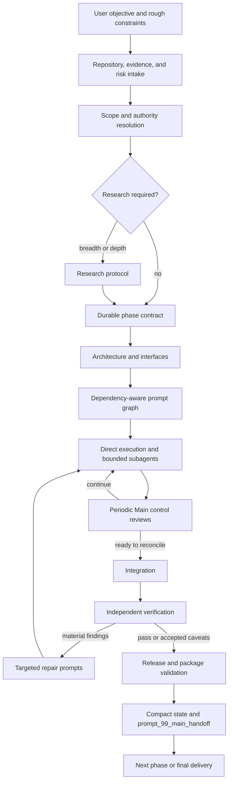
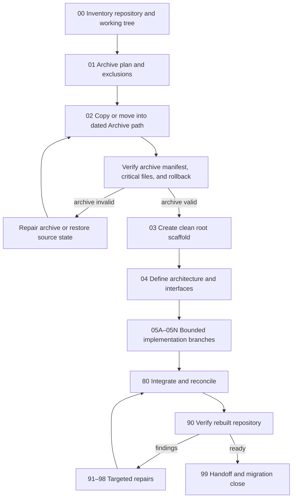
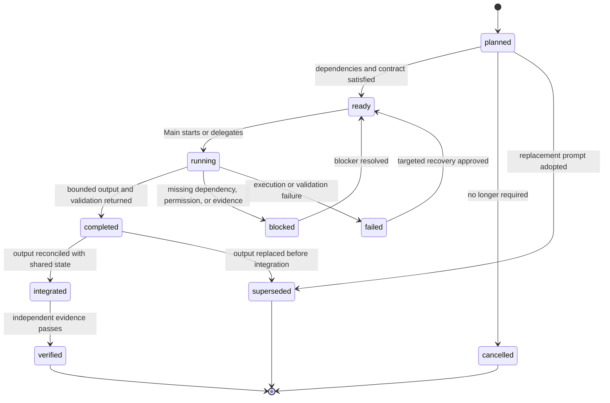
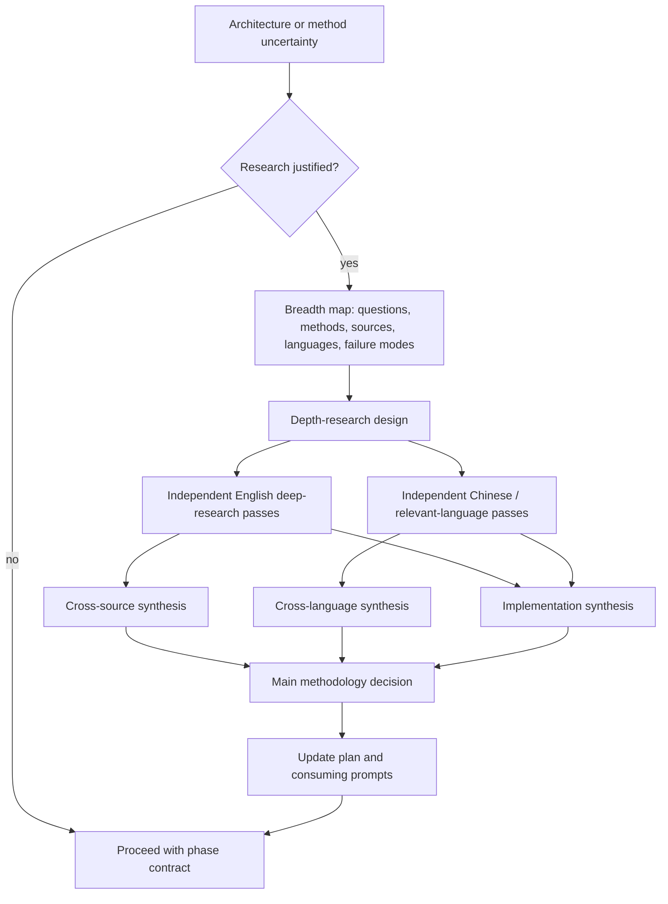
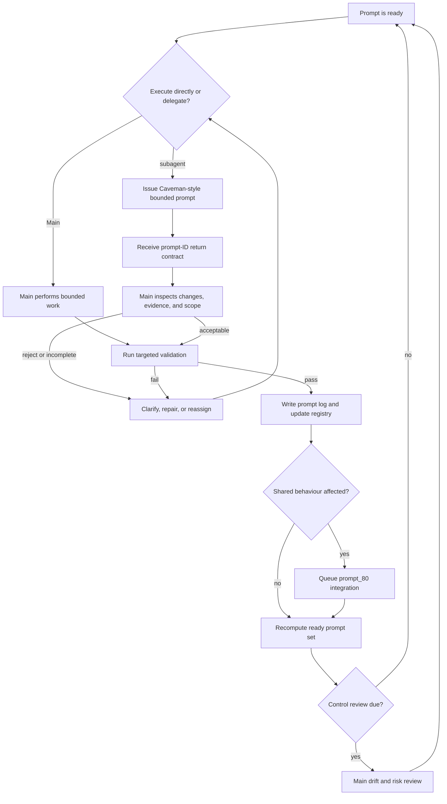
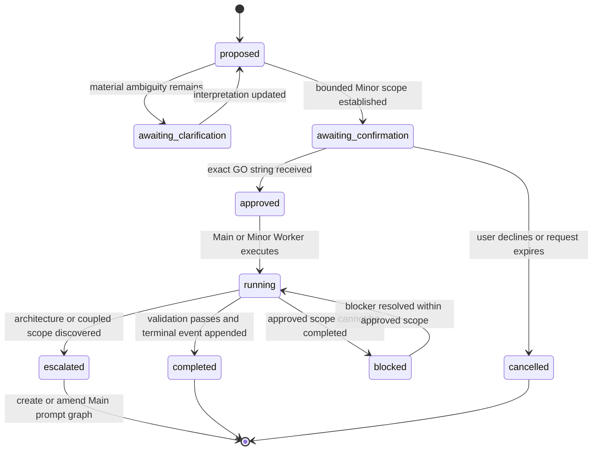
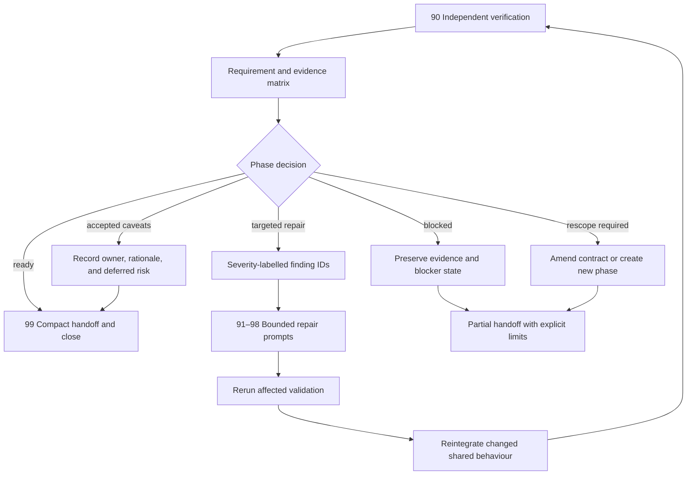
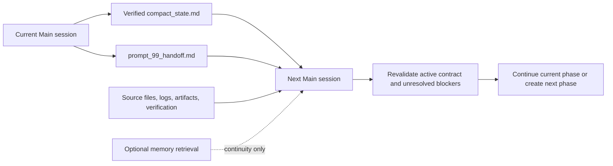

> **Compatibility document (v5.6.35):** retained for older v5.6.31 Goal/Structured usage. For new long-horizon work, the canonical architecture is defined by `.ai-workflow/docs/PHASE_DIC_EPS_STRUCTURE.md` and `.ai-workflow/STATE.json`.

# Distribution note

This is the complete Ultra human/maintainer guide. The live machine runtime is `.ai-workflow/`;
ordinary agents read role-specific machine guides and active prompt contracts. Ultra is not loaded
wholesale into economy Workers.

# GUIDE_ULTRA.md — AI-Native Workflow v5.6.31 Main/Orchestrator Governance

## Purpose

This document is the **maximum-detail operating guide** for AI-Native Workflow v5.6.31.

It is an optional overlay for projects whose value, duration, integration risk, research depth, verification burden, or handoff requirements justify substantially more process than the normal guide. It does not replace `AI_Native_Workflow.md`, `PROMPTING.md`, `SUBAGENT_PROMPTING.md`, or `SUBAGENT_MODEL_SELECTION.md`. It expands them into a complete operating procedure for serious repository refactors, research-code systems, competition repositories, quantitative systems, papers with executable artifacts, production prototypes, complex reports, and other high-consequence projects.

Use this guide when the phase or project explicitly declares:

```yaml
operating_mode: ultra
```

Do not load or repeat this guide for ordinary Low, Mid, or High work. The purpose of separating it is to preserve a lean default context while retaining a rigorous, reusable maximum-detail standard when required.

The five execution-governance levels are:

| Level | Primary meaning | Typical posture |
|---|---|---|
| Low | One bounded reversible task | one economical Worker, focused checks |
| Mid | One coherent multi-file phase | affected tests and bounded verification |
| High | Coupled work packages or experiments | Structured contracts and independent verification |
| XHigh | Broad autonomous multi-stage programme | milestones, resource preflight and repeated integration |
| Ultra | Destructive/private/locked/release work | strongest authority, rollback, provenance and repeated verification |

Research (`none` through `max`), test profile (`focused` through `full`), routing profile and model reasoning are separate axes. Ultra is not a GPT reasoning-effort label.


---


## v5.6.31 normative changes

Ultra now separates Main from Orchestrator. Main owns intent, acceptance, approval and material
adjudication; Orchestrator owns prompt generation, economical routing, integration, repair and
verification dispatch. Exact GO immediately hands control to Orchestrator unless a named critical
blocker exists. Goal and Structured are modes; Low/Mid/High/XHigh/Ultra are execution levels.
Only `.ai-workflow/` is installed. Full human guides, report and presentation remain distribution
artifacts. Minor is first-class and always phase-local. Requests are verifier-completed Markdown
checklists. Repository root, modes, levels, model availability and routing are inserted into prompts
from config. `aw init` creates config-aware root/phase controls; `aw update` refreshes safe prompt
contexts after configuration changes. Full templates are the default.

## 1. Ultra Mode Definition

Ultra mode is the full end-to-end operating posture:

```text
problem shaping
  -> repository and evidence intake
  -> scope and authority resolution
  -> optional breadth research
  -> optional depth research
  -> durable phase contract
  -> architecture and interface definition
  -> dependency-aware prompt graph
  -> dynamic subagent delegation
  -> periodic Main control reviews
  -> integration
  -> independent verification
  -> targeted repair cycles
  -> release/package validation
  -> compact handoff
```



Ultra mode is not synonymous with:

- using the most expensive model for every prompt;
- creating many subagents;
- writing long prompts;
- running every task in parallel;
- conducting research when the answer is already known;
- producing ceremony without evidence;
- asking the user to approve safe local actions repeatedly;
- treating memory or summaries as proof.

Ultra mode means **maximum control quality**, not maximum activity.

### 1.1 Ultra objectives

An Ultra project should optimise for:

1. correctness;
2. preservation of user intent;
3. durable repository state;
4. explicit interfaces and dependencies;
5. evidence-backed completion claims;
6. recoverability after interruption;
7. bounded delegation;
8. independent verification;
9. safe integration;
10. clear handoff to future agents or humans.

### 1.2 Ultra completion standard

An Ultra phase is complete only when:

- user-visible requirements have a verdict;
- the planned architecture matches the implemented repository or deviations are recorded;
- all completed prompts have evidence and logs;
- sibling outputs have been integrated where necessary;
- required tests, builds, smoke runs, renders, or inspections have been performed;
- verification findings are resolved, accepted, or explicitly deferred;
- unsafe claims are removed;
- repository cleanliness is checked;
- the phase status is updated;
- `prompt_99_handoff.md` and compact state are accurate;
- the next action is unambiguous.

---

## 2. When Ultra Mode Is Justified

Use Ultra mode when several of the following are true.

### 2.1 Project-value signals

- The repository will be reused for months or years.
- The output will support a paper, competition, product, deployment, formal review, or external submission.
- An incorrect decision could invalidate substantial work.
- Multiple people or model sessions will continue the project.
- The project contains a large migration or structural rewrite.
- The output must be reproducible.
- The project includes sensitive data, financial calculations, scientific claims, or regulated workflows.

### 2.2 Complexity signals

- Multiple modules, documents, experiments, or interfaces must remain consistent.
- Research choices materially affect architecture.
- Several independent work packages can proceed concurrently.
- Integration is nontrivial.
- More than one execution or verification cycle is likely.
- The repository contains legacy state that must be archived or migrated safely.
- The task requires both code and long-form documentation.

### 2.3 Evidence signals

- Completion must be demonstrated rather than asserted.
- Official-runtime compatibility matters.
- Benchmarks, tests, statistical results, or package contents must be independently checked.
- Source-backed claims must be distinguished from model inference.
- Final artifacts must be inspected, rendered, or opened.

### 2.4 Handoff signals

- Another model, person, or team must continue the work.
- The current conversation may not remain available.
- The project needs a durable decision log.
- The work will span many phases.

### 2.5 Do not use Ultra mode when

- the task is a single reversible edit;
- Main can inspect correctness directly;
- the work has no future continuation value;
- the overhead would exceed the risk reduction;
- the user needs a rapid answer rather than a durable project system;
- all work can be completed and verified in one bounded pass.

When uncertain, start at high mode and promote to Ultra only when the need becomes concrete.

---

## 3. Recommended Repository Placement

The preferred live-repository layout is:

```text
project/
  AGENTS.md
  CLAUDE.md                         # optional platform shim
  GEMINI.md                         # optional platform shim
  agent.manifest.yaml

  .ai-workflow/                 # deterministic tooling
  .ai-workflow/docs/           # standard runtime profile
  .ai-workflow/docs/     # compressed runtime profile
  guides/                # full manuals, including this file

  phases/
    phase_00_project_init/
    phase_01_<name>/

  docs/
  src/
  tests/
  ...
```

A normal repository installation copies only `.ai-workflow/` into the live repository. Run `aw init` to create or retain `AGENTS.md`, `agent.manifest.yaml`, `phases/`, repository-local configuration, declared root context, model availability, and optionally the first phase. The long guides and technical report remain distribution artifacts rather than Ultra runtime dependencies. Presentation-development assets are maintained separately and are not part of the final distribution.

### 3.1 Why the layered root placement is recommended

This placement:

- keeps detailed AI operating documents together;
- prevents root-directory clutter;
- provides a stable path across phases;
- makes the workflow easy to copy, update, or archive;
- separates durable project instructions from phase-specific state;
- allows `AGENTS.md` to remain a short root-level entry point;
- avoids repeating long manuals in every phase.

### 3.2 Root files that should remain visible

Keep these at repository root:

```text
AGENTS.md
agent.manifest.yaml
```

They are the minimal instruction and machine-readable routing entry points.

Platform-specific root shims may also remain visible:

```text
CLAUDE.md
GEMINI.md
```

Each shim should point to `AGENTS.md` and the selected runtime reference rather than duplicate the complete rules.

### 3.3 Phase placement

Keep `phases/` at repository root unless the project has a strong reason to hide workflow state.

Reasons:

- phase status is operational project state, not merely documentation;
- prompts and logs need short, stable paths;
- users should be able to inspect current work without entering a hidden support folder;
- version-control diffs remain easy to review.

### 3.4 Alternative placement

For organisations that prohibit hidden folders, use:

```text
docs/ai-workflow/
```

For monorepos, use either:

```text
.ai-workflow/docs/                          # shared monorepo runtime policy
packages/<package>/.ai-workflow/docs/       # package-specific override
```

The nearest applicable instruction set should govern, but local files must not silently contradict the repository-level authority hierarchy.

### 3.5 Distribution versus live installation

The distributed ZIP may remain versioned, for example:

```text
AI_Native_Workflow_v5_6_4.zip
```

Inside a live repository, use canonical filenames without version suffixes. Record the installed workflow version in:

```yaml
workflow_version: "v5.6.31"
```

Do not encode the version repeatedly in every filename.

---


## 3A. Ultra configuration and prompt synchronisation

Ultra phases must record the exact `.ai-workflow/package.json` and `config.toml` context used to
generate prompts. Initialization should declare repository root, routing profile, model/surface
availability, execution/research/test levels and exact GO.

```bash
aw init --phase phase_01_ultra --mode structured \
  --execution-level ultra --research-level high --test-profile integration \
  --routing-profile all --declared-root D:/Projects/Repo \
  --available-model gpt-5.6-pro --available-model claude-sonnet-4.6
```

Before dispatch and after any configuration change:

```bash
aw status --full
aw models show
aw update
aw validate
```

Safe prompts carry a managed context hash. Default updates modify only planned/ready prompts;
completed, integrated and verified prompts remain immutable evidence. Ultra may use
`--include-frozen` only for a documented metadata-context migration that does not reinterpret the
executed task.

## 4. Ultra Authority Model

### 4.1 Order

```text
user explicit instruction and approvals
-> current durable Main intent contract
-> verified repository/source/artifact truth
-> Orchestrator runtime contract and prompt graph
-> Worker/Minor execution evidence
-> independent Verifier acceptance
-> Main closure or new scoped approval
```

### 4.2 Main

Main preserves exact input, reads before asking, writes acceptance-bearing requests, selects mode and
level, resolves authority and records GO. Main does not default to code execution. After GO it
hands control directly to Orchestrator unless a critical blocker is already known.

### 4.3 Orchestrator

Orchestrator recomputes readiness, generates full prompts, routes cheaper models, integrates every
return, creates bounded repairs, records supersession, invokes Verifier and continues automatically.
It cannot relax acceptance or infer external authority.

### 4.4 Researcher

Researcher builds a source-grounded decision artifact. Research remains distinct from implementation.

### 4.5 Worker and subagents

Workers execute bounded contracts. Subagents report to a parent role, use least privilege and do
not advance the phase. One owner per file.

### 4.6 Verifier

Verifier independently checks source, runs and artifacts, marks requests complete and rejects
unsupported evidence. It does not repair product files.

### 4.7 Minor

Minor is first-class for routine reversible work at phase/root/custom location. Architecture,
data, science, permissions, release and acceptance changes escalate to Main.

e Main prompt graph.

---

## 5. Ultra Project Intake

Before creating a major phase, Main should perform a structured intake.

### 5.1 Intake inputs

Collect or inspect:

- exact user request;
- uploaded files;
- repository tree;
- current branch and status;
- root instruction files;
- active phase files;
- existing architecture and methodology documents;
- tests and build configuration;
- generated artifacts;
- previous verification reports;
- current known blockers;
- external deadlines;
- tool availability;
- permission and data-sensitivity constraints.

### 5.2 Intake output

Main should be able to state:

```text
Current project objective:
Current repository state:
Current phase, if any:
Requested transformation:
Known constraints:
Unknowns that materially affect execution:
Research need:
Execution risk:
Recommended operating mode:
Immediate next action:
```

### 5.3 Read before asking

If a question can be answered from repository files, uploaded documents, logs, or connected sources, inspect those sources before asking the user.

Ask only when the missing information:

- materially changes scope;
- changes an irreversible decision;
- cannot be inferred safely;
- cannot be recovered from available evidence.

### 5.4 Preserve exact user language

Store exact user requests in `REQUESTS.md` or the Minor ledger before translating them into technical language.

Separate:

- user wording;
- Main interpretation;
- assumptions;
- clarification questions;
- adopted decisions.

This prevents a polished implementation plan from replacing the user's actual intent.

---

## 6. Legacy Repository Archive and Rebuild Protocol

Use this protocol for full structural refactors.

### 6.1 Archive principle

Do not delete the old repository structure merely because a cleaner structure is planned.

Prefer:

```text
Archive/
  pre_v6_refactor_<date>/
```

or a project-specific archive path declared in `PLAN.md`.

### 6.2 Archive requirements

Before moving files:

- inspect version-control status;
- identify ignored and generated files;
- record file counts and sizes where relevant;
- identify secrets or sensitive artifacts;
- identify symlinks;
- identify files required by the official runtime;
- identify large binaries and caches;
- define exclusions;
- define rollback.

### 6.3 Archive manifest

Create an archive manifest containing:

```text
archive timestamp
source commit or branch
source paths
excluded paths
moved paths
copied paths
hashes for critical files
known missing files
reason for exclusion
rollback procedure
```

### 6.4 Move versus copy

Use **copy then verify then remove** when:

- failure cost is high;
- the repository contains untracked files;
- the filesystem or tooling is uncertain;
- exact preservation matters.

Use a version-control-aware move when:

- the repository is clean;
- history preservation is useful;
- paths are known;
- tests can validate the transition.

### 6.5 Do not archive blindly

Do not move:

- active secrets into committed archives;
- caches or virtual environments unless explicitly required;
- large generated outputs without a reason;
- official runtime files that must remain at fixed paths;
- user data that should be stored outside the repository.

### 6.6 Rebuild sequence

A typical rebuild graph is:

```text
00 inventory
01 archive plan
02 archive execution
03 new root scaffold
04 architecture and interfaces
05 implementation branches
80 integration
90 verification
91 repairs
99 handoff
```



The archive should be independently verifiable before the new structure is treated as the only source of truth. The clean rebuild must retain a documented rollback path until verification closes the migration.

---

## 7. Ultra Phase Contract

An Ultra phase normally contains:

```text
REQUESTS.md
PLAN.md
README.md
PHASE_ARCHITECTURE.md
prompts/
logs/
reports/
artifacts/
verification/
minor/
research/        # when activated
```

### 7.1 `REQUESTS.md`

`REQUESTS.md` is user-readable and should include:

- objective;
- requested deliverables;
- explicit preferences;
- constraints;
- non-goals;
- approval-sensitive actions;
- acceptance statements written in plain language;
- unresolved questions requiring user decision.

It should not become a detailed implementation manual.

### 7.2 `PLAN.md`

An Ultra `PLAN.md` should include:

1. objective;
2. current-state assessment;
3. scope;
4. non-goals;
5. assumptions;
6. research dependency;
7. architecture decisions;
8. file migration map;
9. implementation sequence;
10. prompt graph;
11. allowed and forbidden changes;
12. interfaces and schemas;
13. validation plan;
14. evidence plan;
15. risk register;
16. rollback or recovery plan;
17. acceptance criteria;
18. packaging and handoff requirements.

### 7.3 Phase `README.md`

The phase `README.md` is the orchestration dashboard.

It should include:

- phase status;
- operating mode;
- research level;
- execution scale;
- prompt registry;
- dependency status;
- concurrency rules;
- shared-file ownership;
- integration policy;
- verification gate;
- Minor status;
- report and artifact locations;
- completion decision.

### 7.4 `PHASE_ARCHITECTURE.md`

For Ultra mode, this file is normally required unless the phase is purely editorial.

It should define:

- current architecture;
- target architecture;
- module boundaries;
- file and directory ownership;
- interfaces;
- data flows;
- state transitions;
- configuration hierarchy;
- naming conventions;
- public versus internal APIs;
- temporary compatibility layers;
- migration order;
- deferred work;
- invariants;
- failure and recovery behaviour.

### 7.5 Contract consistency check

Before execution, Main must check that:

- every request maps to a plan item;
- every plan item maps to one or more prompts;
- every architecture component has an owner or is explicitly deferred;
- every acceptance criterion has a verification method;
- prompt dependencies are acyclic;
- forbidden overlaps are resolved;
- research consumers are identified;
- external actions have approval rules.

---

## 8. Ultra Prompt Graph Design

The prompt graph is the execution plan.

### 8.1 Prompt classes

Use these broad ranges:

| Range | Purpose |
|---|---|
| `000` | Main phase initialisation |
| `00–09` | inspection, inventory, archive, scaffolding |
| `10–69` | research, implementation, experiments, documents |
| `70–79` | migration, packaging, documentation completion |
| `80–89` | integration, reconciliation, verification preparation |
| `90` | independent verification |
| `91–98` | targeted repair and re-verification |
| `99` | compact handoff and phase closure |

The numbers communicate structure but do not override explicit dependencies.

### 8.2 Sibling prompts

Use letter suffixes for sibling work packages:

```text
prompt_03A_implement_cli.md
prompt_03B_rewrite_prompting.md
prompt_03C_build_minor_system.md
```

The suffix does not identify a permanent agent.

### 8.3 Prompt metadata

Every substantial prompt should begin with concise machine-readable metadata:

```yaml
---
prompt_id: 03A
title: Implement workflow CLI
depends_on:
  - "02"
allowed_paths:
  - aw
  - .ai-workflow/aw/**
  - tests/test_component.py
forbidden_paths:
  - Archive/**
risk: medium
subagent_profile: implementation_worker
validation:
  - python -m pytest tests/test_component.py -q
log_path: phases/phase_02_refactor/logs/prompt_03A_implement_cli.md
---
```

### 8.4 Prompt body

Use this order:

```text
Goal
Success criteria
Read first
Scope
Required outputs
Validation and evidence
Integration notes
Stop and escalation conditions
Return contract
```

### 8.5 Prompt independence test

Before allowing prompts to run concurrently, Main should answer:

1. Are all dependencies complete?
2. Do the prompts edit disjoint files or safely partitioned regions?
3. Are shared interfaces stable?
4. Can each prompt validate independently?
5. Is there a defined integration point?
6. Will one prompt's discoveries materially change the other's scope?
7. Can a failure be isolated?
8. Is the expected speed gain worth the integration cost?

If any answer creates material uncertainty, keep the work sequential.

### 8.6 Prompt readiness states

Use:

```text
planned
ready
running
blocked
completed
failed
superseded
cancelled
integrated
verified
```

A prompt may be `completed` but not yet `integrated` or `verified`.



### 8.7 Superseding prompts

Do not rewrite historical prompt files to hide obsolete instructions.

When a prompt is replaced:

- mark it `superseded` in the registry;
- identify the replacement prompt;
- preserve the old file;
- record whether any partial output must be reverted or integrated.

---


## 9. Prompt 000 and Prompt 001 — Ultra Control Procedure

### 9.1 Prompt 000: Main

Main loads root/phase/handoff, reconstructs repository and authority, preserves rough input, ensures
request acceptance, checks rollback/data/release boundaries and presents exact GO. It performs no
product mutation before approval.

When GO is present, Main records it with `aw go`, integrates Prompt 000 and immediately releases
Prompt 001. `--no-advance` requires a named critical blocker. Main does not ask the same GO twice.

### 9.2 Prompt 001: Orchestrator

Orchestrator validates root, status, next-ready set and phase graph. Goal Mode generates one next
prompt; Structured Mode consumes the full plan/architecture. Orchestrator records model profiles,
permissions, paths, outputs, checks, evidence and stop rules for every dispatch.

### 9.3 Runtime control

```text
ready -> prompt validation -> economical dispatch -> evidence collection
-> integration -> independent verification where required -> next-ready
```

Periodic Main reviews occur at changed-scope, resource, method, evidence and release gates, not
after every routine prompt.

en verification can begin.

---

## 10. Ultra Subagent Delegation

Subagent guidance is split across `SUBAGENT_PROMPTING.md` and `SUBAGENT_MODEL_SELECTION.md`. Ultra mode adds stricter allocation and return rules.

### 10.1 Delegate work, not responsibility

The user does not manually delegate executors. Main converts the approved phase contract into bounded work packages and decides whether each is executed directly or by a subagent.

Main remains responsible for:

- choosing the task;
- defining scope;
- checking the result;
- integrating it;
- deciding readiness.

### 10.2 Capability profiles

Common profiles:

| Profile | Suitable work |
|---|---|
| Repository Inspector | tree mapping, dependency discovery, ownership mapping |
| Source Extractor | bounded factual extraction with citations or line references |
| Research Worker | one defined research question or source family |
| Implementation Worker | bounded code or document implementation |
| Test Worker | deterministic tests, builds, smoke runs, failure capture |
| Documentation Worker | bounded docs aligned to approved architecture |
| Integration Reviewer | cross-file reconciliation and interface checking |
| Verification Worker | independent requirement and evidence review |
| Minor Worker | confirmed non-architectural request |

### 10.3 OpenAI-family allocation posture

For OpenAI-family agents:

- prefer concise outcome contracts;
- expose only relevant tools;
- state success and stop conditions;
- use model-directed delegation only within the prompt's authority;
- reserve high or maximum reasoning for tasks that show measured benefit;
- allow independent tool calls to run concurrently when safe;
- require a structured return that preserves evidence.

Use Caveman style explicitly for mechanical subagent instructions.

### 10.4 Claude-family allocation posture

For Claude-family agents:

- define the subagent's context and tool permissions clearly;
- use narrow task descriptions;
- use model selection intentionally rather than inheriting the strongest model automatically;
- take advantage of isolated context for exploration or review;
- state file boundaries and whether edits are allowed;
- require the same prompt-ID return contract;
- prevent the subagent from becoming an undeclared phase owner.

Use Caveman style explicitly for mechanical subagent instructions.

### 10.5 Ultra return contract

Every subagent should return:

```text
Prompt ID:
Task performed:
Outcome:
Files read:
Files changed:
Commands run:
Validation performed:
Evidence:
Unresolved issues:
Scope deviations:
Integration notes:
Recommended next action:
```

### 10.6 Result rejection criteria

Main should reject or return a result when:

- the prompt ID is missing;
- changed files exceed scope;
- validation is claimed without output;
- the result relies on unverified memory;
- required evidence is absent;
- architecture was changed without authority;
- the output is placeholder-only;
- the subagent hid errors or caveats;
- shared files were modified without coordination.

---

## 11. Ultra Research Protocol

Research remains optional. Ultra execution does not imply Max research. When Max or Ultra research is justified, however, the intended evidence programme is explicitly multilingual unless Main records a defensible monolingual exception.

### 11.1 Max research and Ultra research are related but not identical

| Programme | Primary objective | Shared structure | Additional requirement |
|---|---|---|---|
| **Max research** | Maximize breadth, depth, multilingual coverage, and synthesis quality | Breadth map → multilingual depth → multiple syntheses → Main methodology decision | Complete evidence coverage and a named implementation consumer |
| **Ultra research** | Make the Max evidence programme governable, reproducible, and recoverable | The same multilingual research structure | Source manifest, independent model families, contradiction matrix, primary-source verification, decision log, archive, and handoff |

### 11.2 Activation

Activate research when current facts, method uncertainty, literature, multilingual or jurisdictional evidence, source disagreement, or the cost of an unsupported assumption materially affects the phase.

### 11.3 Specialized research surface

Broad investigation should normally be delegated to one or more external deep-research agents or dedicated research-capable models. Their post-training, browsing tools, search control, data-analysis support, and citation workflow are better aligned with evidence acquisition than a coding surface optimized for repository mutation and tests. Main remains the decision authority and verifies decisive primary sources.

### 11.4 Research folder

```text
research/
  README.md
  prompts/
  sources/
  reports/
  synthesis/
```

The README records the objective, questions, source hierarchy, date limits, language scope, evidence classes, outputs, consuming prompts, and status.

### 11.5 Breadth discovery / init large research

The first pass is intentionally broad. It discovers:

- subquestions;
- competing method families;
- source communities and primary sources;
- English, Chinese, and other relevant terminology;
- relevant jurisdictions and languages;
- evaluation criteria;
- likely disagreements and missing evidence;
- implementation implications and failure modes;
- the exact questions the depth prompts must answer.

Breadth is a research-design artifact, not the final answer. Main reviews it before authorizing depth passes.

### 11.6 Multilingual depth research

The default Max/Ultra depth stack is:

```text
breadth discovery
  -> depth-research design
  -> English deep-research prompt
  -> Chinese deep-research prompt
  -> other decision-relevant language prompts when justified
  -> more than two independent outputs per material language where feasible
  -> three synthesis reports
  -> Main methodology reference
```

Language-specific passes use native terminology and source ecosystems. They are not mechanical translations of one English query. If the evidence base is effectively monolingual, Main records the exception and the evidence supporting it.

### 11.7 Three synthesis functions

The synthesis stage should normally produce three distinct views:

1. **cross-source synthesis** — agreements, disagreements, evidence strength, and source quality;
2. **cross-language synthesis** — terminology, jurisdictional, institutional, or regional differences;
3. **implementation synthesis** — recommended methodology, rejected alternatives, assumptions, risks, and execution implications.

Main then writes the final methodology reference and states what was adopted, rejected, deferred, or left uncertain.

### 11.8 Ultra governance additions

Ultra research adds:

- versioned source manifest and retrieval dates;
- independent research engines or model families where practical;
- explicit source-to-claim mapping;
- contradiction and confidence matrix;
- primary-source verification for decisive claims;
- decision log and named consuming prompts;
- archive sufficient for later reproduction and handoff.

### 11.9 Research decision gate



Research with no identified decision or consumer prompt should stop. A source can justify a method; it does not prove that the repository implemented or tested it.

---

## 12. Ultra Execution Protocol

### 12.1 Preparation gate

Before implementation begins:

- phase contract approved or sufficiently stable;
- architecture written;
- prompt graph valid;
- repository status inspected;
- archive complete where required;
- tool availability recorded;
- tests or validation strategy known;
- external permissions resolved;
- sensitive data handling defined.

### 12.2 Execution cycle

For each prompt:

1. confirm readiness;
2. snapshot relevant state where useful;
3. assign direct or delegated execution;
4. perform bounded changes;
5. run targeted validation;
6. write prompt log;
7. inspect result;
8. update registry;
9. integrate or queue integration;
10. decide next ready set.



### 12.3 Prompt log standard

A log should contain:

```text
prompt ID
start and completion status
files read
files changed
commands run
validation results
artifacts generated
assumptions
caveats
unresolved issues
scope deviations
integration dependencies
```

### 12.4 Code execution evidence

For code, preserve where applicable:

- exact command;
- exit code;
- relevant stdout and stderr;
- test count;
- skipped tests;
- environment or version;
- generated files;
- benchmark configuration;
- runtime limitations.

### 12.5 Document execution evidence

For documents, preserve where applicable:

- source files read;
- sections changed;
- claims added or removed;
- citation checks;
- formatting checks;
- rendered output;
- page or section inspection;
- unresolved placeholders.

### 12.6 Visual artifact evidence

For slides, PDFs, figures, web interfaces, or other visual artifacts:

- render the artifact;
- inspect clipping;
- inspect spacing and hierarchy;
- inspect missing content;
- inspect fonts and assets;
- inspect representative pages or states;
- revise before completion.

### 12.7 Quantitative and research-code evidence

For quantitative systems:

- identify data split;
- identify leakage controls;
- identify random seeds;
- identify sample versus full runs;
- identify fallback or proxy methods;
- preserve metrics and confidence intervals where relevant;
- distinguish smoke performance from credible evaluation;
- record environment and hardware where material.

---

## 13. Periodic Main Control Reviews

Ultra mode uses periodic control reviews to detect drift before final verification.

### 13.1 Review frequency

Use a review:

- after each risky prompt;
- after a major milestone;
- after several low-risk prompts;
- when interfaces change;
- when a subagent reports a blocker;
- before integration;
- before official or expensive runs.

### 13.2 Review questions

Main should ask:

1. What changed?
2. What evidence exists?
3. What requirements are now satisfied?
4. What assumptions changed?
5. Did any prompt exceed scope?
6. Are dependencies still valid?
7. Are concurrent changes still compatible?
8. Is the next prompt still correct?
9. Should the phase be repaired, rescaled, or continued?

### 13.3 Review output

Write a short status note containing:

```text
current prompt state
completed evidence
new blockers
architecture drift
risk changes
next ready prompts
prompts requiring revision
```

The review is not a substitute for independent verification.

---

## 14. Ultra Integration Protocol

Integration is a distinct work package when sibling outputs affect shared behaviour.

### 14.1 Integration inputs

- completed sibling prompts;
- changed files;
- logs;
- interface definitions;
- tests;
- known caveats;
- architecture.

### 14.2 Integration tasks

- resolve conflicting assumptions;
- reconcile naming and schemas;
- update imports and paths;
- remove obsolete compatibility code where approved;
- run cross-module tests;
- update docs and manifests;
- inspect final repository tree;
- record integration decisions.

### 14.3 Integration log

Record:

```text
inputs integrated
conflicts found
conflict resolutions
files changed during integration
cross-component validation
remaining inconsistencies
readiness for verification
```

### 14.4 Integration anti-patterns

Do not:

- merge outputs without reading logs;
- assume file-disjoint work is behaviour-disjoint;
- let one subagent silently rewrite another's output;
- use final verification as the first integration test;
- mark prompts verified merely because each passed locally.

---

## 15. Ultra Minor Protocol

The Minor structure remains intentionally flat:

```text
minor/
  prompt_000_minor_init.md
  REQUESTS.md
  logs/
  reports/
```

### 15.1 Request classes

- `MinorFix`: bounded correction;
- `MinorUpdate`: bounded non-architectural update;
- `MinorReport`: bounded read-only analysis or report.

### 15.2 Proposal requirements

Append:

- request ID;
- exact user input;
- agent interpretation;
- clarification questions;
- expected affected files;
- excluded files;
- risk assessment;
- change type;
- confirmation string.

### 15.3 Confirmation

Use exact request-specific confirmation:

```text
GO MinorFix 01
GO MinorUpdate 01
GO MinorReport 01
```

Do not implement before confirmation.

### 15.4 Execution

After approval:

- execute directly or delegate one bounded Minor Worker;
- use Caveman style for the delegated prompt;
- remain inside approved files;
- validate;
- write a log or report;
- append a terminal event.

### 15.5 Escalation

Escalate to Main when the request changes:

- architecture;
- public interfaces;
- dependencies;
- security or permissions;
- deployment;
- several coupled file families;
- acceptance criteria;
- the active prompt graph.



A Minor request that reaches `escalated` leaves the Minor workflow. Its exact history remains in `minor/REQUESTS.md`, while Main creates the appropriate phase prompt or new phase.

---

## 16. Ultra Verification Protocol

Verification should be independent from implementation where practical.

### 16.1 Verification inputs

Verifier reads:

```text
REQUESTS.md
PLAN.md
README.md
PHASE_ARCHITECTURE.md
prompt files
prompt logs
integration log
changed files or diff
commands and test outputs
artifacts
research synthesis where relevant
Minor ledger events
known caveats
```

### 16.2 Requirement matrix

Use:

| Requirement | Planned implementation | Evidence | Verdict | Severity | Repair |
|---|---|---|---|---|---|

Verdicts:

```text
pass
partial
fail
blocked
not evidenced
not applicable
```

### 16.3 Evidence distinctions

Verifier must distinguish:

- implemented versus claimed;
- configured versus executed;
- imported versus exercised;
- sample versus full evidence;
- smoke run versus credible evaluation;
- local compatibility versus official compatibility;
- fallback versus intended method;
- generated artifact versus inspected artifact;
- cache written versus cache hit demonstrated;
- package built versus package contents verified;
- memory summary versus source evidence.

### 16.4 Severity

Use:

```text
critical
high
medium
low
informational
```

### 16.5 Phase decision

Verifier should conclude:

```text
ready
ready with accepted caveats
repair required
partially complete
blocked
rescope required
```

### 16.6 Verification independence

If independent verification is unavailable:

- state that verification is Main self-review;
- increase evidence scrutiny;
- avoid calling it independent;
- identify what an independent reviewer should inspect later.

---

## 17. Ultra Repair Cycle

Verification findings should produce targeted repair prompts, not a vague instruction to “fix everything.”

### 17.1 Repair prompt requirements

Each repair prompt should identify:

- finding IDs;
- exact defect;
- affected files;
- expected correction;
- forbidden collateral changes;
- validation;
- evidence;
- re-verification requirement.

### 17.2 Repair numbering

Use:

```text
prompt_91_fix_critical_findings.md
prompt_92_fix_documentation_consistency.md
prompt_93_rerun_validation.md
```

### 17.3 Repair completion

A repair prompt is complete only when:

- the defect is corrected or explicitly blocked;
- validation is rerun;
- the verification report is amended or a re-verification report is produced;
- no new material regression is introduced.

### 17.4 Avoid broad rewrites

Do not let a repair cycle become an undeclared second architecture phase. Escalate or create a new phase when the required change is structurally larger than the original phase contract.



---


## 18. Ultra CLI Use

### 18.1 Appropriate operations

Use `aw` for root/config resolution, phase scaffolding, checklist/event updates, prompt lifecycle,
Minor lifecycle, validation, migration and next-phase proposals. Semantic architecture, research and
scientific decisions remain outside deterministic code.

### 18.2 Core commands

```bash
aw root show|set|auto|env
aw status
aw go
aw next
aw phase init|current|use|append|plan-next
aw request add|list|verify|block|reopen
aw prompt add|list|next|set|supersede
aw minor init|add|show|note|approve|done|status|sample
aw config show|set
aw validate
aw migrate
```

### 18.3 Ultra requirements

- status commands are read-only;
- exact IDs and actor restrictions;
- output paths must fit prompt authority;
- append-only approval/request/Minor/prompt events;
- root containment and path safety;
- no hidden semantic decision in CLI;
- validator checks graph, requests, root metadata, report allowlist and structured architecture;
- `aw phase plan-next --create` remains a scoped, inspectable transition from a verified handoff.

fore verification;
- before handoff.

---

## 19. Ultra Context and Memory Management

### 19.1 Stable context

Keep stable runtime rules in the selected reference profile and reference them rather than duplicating them.

Do not paste the full manuals into every child prompt.

### 19.2 Task-local context

A subagent receives only:

- the applicable root rules;
- the phase contract sections it needs;
- the assigned prompt;
- relevant files;
- necessary evidence.

### 19.3 Terminal-output budget

Use RTK when installed and supported output would otherwise displace decision-relevant context. Record `rtk gain` where useful, preserve raw logs, and rerun unfiltered commands if the compressed view omits an error, warning, or stack trace needed for verification. RTK is an output filter, not a reasoning or evidence standard.

### 19.4 Compact after milestones

Compact when:

- a phase milestone is complete;
- context contains large obsolete logs;
- architecture has stabilised;
- before switching Main sessions;
- before a new phase.

Do not compact away unresolved blockers or evidence locations.

### 19.5 Memory layers

Memory may help retrieve:

- prior decisions;
- phase history;
- old compact states;
- user preferences;
- unresolved issues.

Memory must not replace source inspection for important claims.

### 19.6 `prompt_99_handoff.md`

The handoff should include:

1. project objective;
2. active workflow version;
3. repository placement;
4. current phase status;
5. completed prompts;
6. integrated outputs;
7. verified requirements;
8. accepted caveats;
9. unresolved blockers;
10. files changed;
11. critical architecture decisions;
12. tool and model assumptions;
13. current repository tree summary;
14. next phase recommendation;
15. files the next Main must read;
16. safe Minor candidates;
17. actions requiring user approval.



The next Main must treat compact state and memory as routing aids. Claims that affect execution or readiness must be checked against source files and verification evidence.

---

## 20. Ultra Security, Permissions, and External Actions

### 20.1 Local safe actions

When the user asks to build, fix, or change the repository, Main may normally perform in-scope local reads, edits, tests, and non-destructive validation without repeated approval.

### 20.2 Confirmation-required actions

Require explicit approval for:

- destructive deletion without recovery;
- external writes or messages;
- deployment;
- purchases or paid resources;
- publishing;
- credential or permission changes;
- force-push or history rewriting;
- data transfer outside approved boundaries;
- material scope expansion.

### 20.3 Secrets

Do not place secrets in:

- prompts;
- logs;
- reports;
- archives;
- committed configuration;
- generated examples.

Record secret names and expected injection mechanisms, not secret values.

### 20.4 Sensitive data

The phase plan should state:

- data classification;
- allowed storage;
- allowed tools;
- redaction requirements;
- retention;
- whether external model services are permitted.

---

## 21. Ultra Release and Packaging Protocol

For phases that produce a deliverable package:

### 21.1 Release inputs

- verified repository state;
- version or release identifier;
- manifest;
- required artifacts;
- installation instructions;
- known limitations;
- licence or attribution requirements;
- checksums where useful.

### 21.2 Package checks

Inspect:

- file list;
- accidental caches;
- temporary files;
- secrets;
- duplicate versions;
- stale generated outputs;
- broken internal links;
- executable permissions;
- archive extraction;
- manifest hashes;
- README entry points.

### 21.3 Release claims

Do not claim:

- official compatibility without official-runtime evidence;
- reproducibility without documented inputs and commands;
- full performance from a smoke run;
- clean packaging without inspecting archive contents;
- complete source release when runtime files are absent.

### 21.4 Distribution naming

Version the distribution artifact:

```text
project_name_v6_0.zip
```

Keep internal live-repository instruction filenames canonical and unversioned.

---

## 22. Ultra Failure and Recovery Protocol

### 22.1 Failure classes

- prompt failure;
- tool failure;
- test failure;
- integration failure;
- evidence failure;
- permission failure;
- architecture contradiction;
- repository corruption;
- external dependency failure;
- context or memory loss.

### 22.2 Immediate response

When failure occurs:

1. stop unsafe continuation;
2. preserve exact error evidence;
3. identify changed files;
4. determine whether rollback is needed;
5. classify the failure;
6. update the prompt registry;
7. write a blocker note;
8. create a targeted recovery prompt or escalate.

### 22.3 Rollback

Rollback should be based on:

- version control;
- archived state;
- atomic backups;
- generated manifests;
- known clean commits.

Do not “repair” a corrupted state by guessing what the old files contained.

### 22.4 Partial completion

When full completion is impossible:

- preserve completed valid work;
- state what is incomplete;
- state what is unverified;
- provide the next executable prompt;
- avoid presenting partial work as ready.

---

## 23. Ultra Metrics and Process Evaluation

Ultra mode should itself be evaluated.

### 23.1 Quality metrics

- requirement pass rate;
- verification severity count;
- regression count;
- prompt rework rate;
- evidence completeness;
- integration defect count;
- escaped defect count;
- handoff completeness.

### 23.2 Efficiency metrics

- prompts completed per phase;
- unnecessary prompt count;
- duplicate reads;
- token or context overhead;
- model escalation frequency;
- subagent result rejection rate;
- parallel speedup versus integration cost;
- unused research output.

### 23.3 Process improvement

After a serious phase, record:

- which prompt instructions changed behaviour;
- which rules were redundant;
- where the model needed stronger constraints;
- where the model performed reliably without scaffolding;
- whether lower model or reasoning levels would have sufficed;
- whether the prompt graph was too fragmented;
- whether verification found issues early enough.

Use these findings to simplify future phases rather than accumulating permanent prompt bloat.

---

## 24. Ultra Phase Readiness Checklist

Before starting:

```text
[ ] user objective preserved
[ ] scope and non-goals written
[ ] repository status inspected
[ ] archive or rollback plan defined
[ ] research level selected
[ ] execution mode set to ultra
[ ] architecture written
[ ] prompt graph acyclic
[ ] file ownership clear
[ ] shared interfaces stable enough
[ ] validation plan written
[ ] evidence requirements written
[ ] external approvals identified
[ ] tool availability recorded
[ ] Main init prompt present
[ ] Minor ledger present
[ ] optional research folder created only if needed
```

---

## 25. Ultra Prompt Completion Checklist

For each prompt:

```text
[ ] dependencies complete
[ ] scope still valid
[ ] files read recorded
[ ] files changed recorded
[ ] commands recorded
[ ] validation executed or limitation explained
[ ] evidence preserved
[ ] caveats recorded
[ ] scope deviations absent or approved
[ ] integration dependency updated
[ ] registry status updated
```

---

## 26. Ultra Verification Checklist

```text
[ ] all requirements have verdicts
[ ] architecture matches implementation
[ ] no unsupported completion claims
[ ] tests distinguished from smoke runs
[ ] official compatibility distinguished from local compatibility
[ ] research claims distinguish source and inference
[ ] Minor requests show approval before execution
[ ] archives and generated files inspected
[ ] package contents inspected
[ ] critical and high findings resolved or accepted explicitly
[ ] handoff reflects actual state
```

---

## 27. Ultra Handoff Checklist

```text
[ ] compact state written
[ ] prompt_99_handoff.md written
[ ] current phase status correct
[ ] changed-file summary complete
[ ] verification outcome recorded
[ ] unresolved issues prioritised
[ ] next prompt or phase identified
[ ] required reading order listed
[ ] tool and model assumptions dated
[ ] no secrets or temporary files included
```

---

## 28. Full Ultra Phase Example

```text
phases/
  phase_02_full_structural_refactor/
    REQUESTS.md
    PLAN.md
    README.md
    PHASE_ARCHITECTURE.md

    prompts/
      prompt_000_orchestrator_init.md
      prompt_00_inventory_repository.md
      prompt_01_plan_archive.md
      prompt_02_archive_legacy_structure.md
      prompt_03_create_new_root_structure.md
      prompt_04A_implement_workflow_cli.md
      prompt_04B_rewrite_prompting_architecture.md
      prompt_04C_rewrite_subagent_guides.md
      prompt_04D_implement_minor_ledger.md
      prompt_04E_create_ultra_guide.md
      prompt_05_update_installation_and_platform_shims.md
      prompt_06_migrate_templates.md
      prompt_07_run_prompt_regression_cases.md
      prompt_80_integrate_all_components.md
      prompt_81_run_package_and_structure_checks.md
      prompt_90_verify.md
      prompt_91_fix_critical_and_high_findings.md
      prompt_92_reverify.md
      prompt_99_handoff.md

    logs/
      prompt_00_inventory_repository.md
      prompt_01_plan_archive.md
      prompt_02_archive_legacy_structure.md
      prompt_03_create_new_root_structure.md
      prompt_04A_implement_workflow_cli.md
      prompt_04B_rewrite_prompting_architecture.md
      prompt_04C_rewrite_subagent_guides.md
      prompt_04D_implement_minor_ledger.md
      prompt_04E_create_ultra_guide.md
      prompt_80_integrate_all_components.md
      prompt_81_run_package_and_structure_checks.md

    reports/
      current_state_inventory.md
      archive_manifest.md
      integration_summary.md
      compact_state.md

    artifacts/
      package_manifest.json
      release_archive.zip
      release_archive.zip.sha256

    verification/
      verification_report.md
      reverification_report.md

    minor/
      prompt_000_minor_init.md
      REQUESTS.md
      logs/
      reports/

    research/
      README.md
      prompts/
      sources/
      reports/
      synthesis/
```

---

## 29. Minimal Ultra Declaration

Add this to the phase `README.md`:

```yaml
operating_mode: ultra
ultra_guide: guides/GUIDE_ULTRA.md
research_level: <none|low|mid|high|max>
execution_scale: max
independent_verification_required: true
periodic_main_review: true
package_validation_required: <true|false>
```

The declaration activates this guide. It does not require every optional practice when irrelevant. Main should apply the sections that materially reduce risk and document any deliberate omissions.

---

## 30. Final Ultra Operating Rules

1. Preserve user intent before translating it into architecture.
2. Keep the default instruction stack lean; load this guide only for Ultra work.
3. Place full manuals under `guides/`, runtime instructions under `.ai-workflow/docs/`, and deterministic tooling under `.ai-workflow/`.
4. Keep `AGENTS.md` and `agent.manifest.yaml` at root as short entry points.
5. Keep phase state under root `phases/`.
6. Let Main schedule prompt work packages rather than permanent workers.
7. Delegate only bounded work with explicit file, validation, evidence, and stop rules.
8. Use Caveman style explicitly for mechanical subagents.
9. Parallelise only when dependencies, paths, and interfaces permit it.
10. Treat research as optional and separate source evidence from implementation evidence.
11. Keep Minor work append-only, confirmed, and non-architectural.
12. Integrate before claiming system-level completion.
13. Verify independently where practical.
14. Convert findings into targeted repairs.
15. Inspect packages and visual artifacts before release.
16. Compact only after blockers and evidence locations are preserved.
17. Version the distribution package, not every live instruction filename.
18. End every Ultra phase with an accurate handoff and a clear next action.
