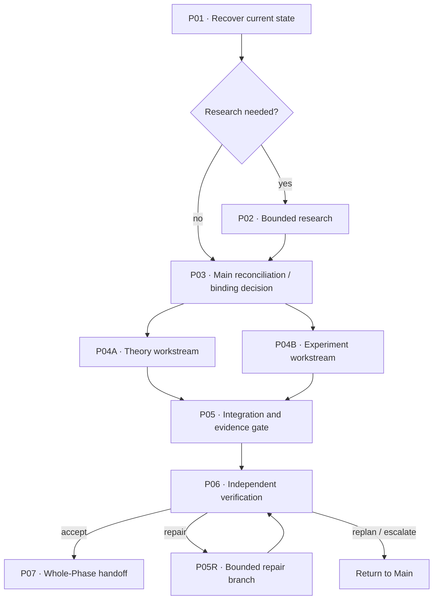

# Durable Phase Execution Graph

This file is the planning view of the Phase's single DIC. Main owns this durable topology. The coding-agent Orchestrator realizes it through one or more disposable EPS attempts.

## Graph

Delete unused branches. Do not retain decorative nodes that have no executable or evidentiary meaning.

## Node contract

| Node | Primary outcome | Depends on | Parallel group | Owner/workstream | Reads | Writes | Evidence target | Merge/gate |
|---|---|---|---|---|---|---|---|---|
| P01 | {{P01_OUTCOME}} | — | — | Orchestrator | {{P01_READS}} | {{P01_WRITES}} | {{P01_EVIDENCE}} | — |
| P02 | {{P02_OUTCOME}} | P01 | research | Research | {{P02_READS}} | {{P02_WRITES}} | {{P02_EVIDENCE}} | P03 |
| P03 | {{P03_OUTCOME}} | P01/P02 | — | Main | {{P03_READS}} | {{P03_WRITES}} | binding decision | — |
| P04A | {{P04A_OUTCOME}} | P03 | core | Theory | {{P04A_READS}} | {{P04A_WRITES}} | {{P04A_EVIDENCE}} | P05 |
| P04B | {{P04B_OUTCOME}} | P03 | core | Experiment | {{P04B_READS}} | {{P04B_WRITES}} | {{P04B_EVIDENCE}} | P05 |
| P05 | {{P05_OUTCOME}} | P04A/P04B | — | Orchestrator | {{P05_READS}} | {{P05_WRITES}} | integrated evidence | gate |
| P06 | {{P06_OUTCOME}} | P05 | — | Verifier | {{P06_READS}} | {{P06_WRITES}} | accept/repair/replan/escalate | gate |

## Orchestrator realization

- Instantiate only the ready DIC nodes or a small ready dependency window.
- Produce a model-tuned concrete EPS prompt to the selected coding model/surface using `PROMPTING_CORE.md` plus the relevant provider guide.
- Prefer one primary outcome and one to three tightly coupled work packages per prompt.
- Split independent or differently verifiable work; avoid one prompt per shell command.
- Use bounded subagents where work is genuinely independent, context-isolatable, or specialized.
- Keep shared-state and overlapping-write work serial unless a merge protocol is explicit.
- Preserve failed/superseded attempts and regenerate EPS for bounded repair.

## Material stops

{{MATERIAL_STOPS}}
