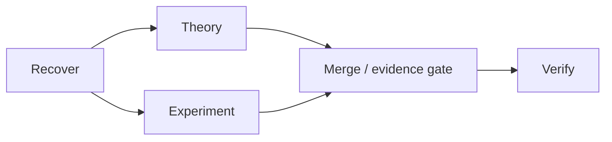

# NeurIPS 2026 Education Track — Slide Plan

## Proposed educational resource

**Working title:** From Feedback to Recovery: Verification as Execution Control for Long-Horizon Agents

**Concept:** Verification-gated execution — using evidence checks to select an agent's next state (`accept`, bounded `repair`, upward `replan`, or human/material `escalate`) while preserving only work whose dependencies and evidence remain valid.

**Primary audience:** First-time NeurIPS attendees, early-stage researchers, advanced undergraduates, educators, and non-specialists familiar with basic machine-learning and software-testing ideas but not agent-runtime design.

**Prerequisites:**

- basic familiarity with language-model agents and tool calls;
- elementary directed graphs and dependencies;
- no formal runtime-verification background required;
- no prior knowledge of AI-Native Workflow required.

## Learning objectives

By the end, learners should be able to:

1. **Distinguish** plausible completion, integrated evidence, and verified acceptance.
2. **Explain** why a verifier can be an execution controller rather than only a final scorer.
3. **Map** a long task into persistent intent, disposable execution attempts, actions, and evidence.
4. **Choose** among `accept`, `repair`, `replan`, and `escalate` for concrete failure cases.
5. **Compute** a declared downstream impact cone in a small dependency graph.
6. **Identify** the assumptions under which unaffected work may be retained safely.
7. **Design** one bounded verifier gate and recovery rule for an agent task of their own.

## Pedagogical stance

Teach the concept before the implementation. Use minimal acronyms at first:

```text
persistent intent
→ bounded attempt
→ action and evidence
→ verification
→ next execution state
```

Introduce DIC and EPS only after learners understand the durable/disposable distinction. Present AI-Native Workflow as one inspectable example, not as a universal standard or product tutorial.

## Core deck — 17 slides / approximately 18–20 minutes

| Slide | Title | Main learning point | Visual / activity | Approx. time |
|---:|---|---|---|---:|
| 1 | From Feedback to Recovery | Verification can change what an agent does next | One failed multi-step trajectory, with “restart everything?” | 0:40 |
| 2 | The long-horizon failure | Local plausibility does not imply global correctness | Five-step task where step 2 becomes stale after step 5 | 1:10 |
| 3 | Four statements that are not equivalent | Output ≠ evidence ≠ integration ≠ acceptance | Four cards learners order | 1:00 |
| 4 | Scoring versus control | A final score diagnoses; a control signal selects a next state | Split screen: post-hoc score vs closed loop | 1:10 |
| 5 | The four control outcomes | `accept`, `repair`, `replan`, `escalate` have different authority consequences | Decision quadrant | 1:20 |
| 6 | Persistent intent, disposable attempts | Stable objectives should survive failed operational attempts | Durable contract above two replacement attempts | 1:10 |
| 7 | One concrete hierarchy | Goal → Plan → Phase → one DIC → EPS → Prompt/Run → Action | Layered strip; define only what is needed | 1:10 |
| 8 | The one-DIC, three-view pattern | One Phase contract can have complementary views | README / REQUESTS / PLAN triangle | 1:00 |
| 9 | Where sequence and parallelism live | The durable dependency graph belongs in the Plan view | Small graph with parallel branches and merge gate | 1:00 |
| 10 | Worked failure | A schema/version check rejects one producer | Seven-node deterministic example | 1:15 |
| 11 | What must be rerun? | Changed outputs affect declared readers and descendants | Learners shade the impact cone | 1:30 |
| 12 | What may be retained? | Unaffected work can remain valid only under explicit assumptions | Retained `collect` and `theory` highlighted | 1:10 |
| 13 | The locality theorem, intuitively | No changed input and no changed predecessor means no declared reason to invalidate | Topological “domino” explanation; optional formal box | 1:20 |
| 14 | Where the guarantee breaks | Hidden dependencies, mutable shared state, weak verification, or stale versions defeat locality | Four failure icons | 1:10 |
| 15 | Main, Research, and execution | Research informs a binding decision; a coding Orchestrator realizes the Phase | Main → Research → Main → DIC → Orchestrator | 1:00 |
| 16 | Design exercise | Create one verifier gate for a research/code task | 90-second pair exercise; template on screen | 1:40 |
| 17 | Takeaway and reusable checklist | Persist intent; bind evidence; verify; recover only within justified scope | Seven-question learner checklist + QR/link placeholder | 0:50 |

## Slide-by-slide specification

### Slide 1 — From Feedback to Recovery

**Headline:** A verifier is most useful when its result changes execution.

**Visual:**

```text
collect → normalize → experiment → table → paper
              X
```

Ask: “After fixing `normalize`, must we restart everything?” Do not answer yet.

### Slide 2 — The long-horizon failure

Show that each local step can look reasonable while a late check reveals stale evidence. Frame the problem as **state and dependency management**, not merely hallucination.

### Slide 3 — Four statements that are not equivalent

```text
The model said it finished.
A file exists.
The returned file was integrated.
The accepted criteria were independently checked.
```

Learners order these from weakest to strongest.

### Slide 4 — Scoring versus control

**Post-hoc evaluation:** output → score.

**Verification-gated execution:** action → evidence → verifier → next state.

Emphasize that both are useful; the new concept is the control-loop role.

### Slide 5 — The four outcomes

| Outcome | Meaning | Who continues? |
|---|---|---|
| `accept` | Evidence satisfies the current contract | Close/advance |
| `repair` | Local defect; intent remains valid | Coding Orchestrator creates a bounded new attempt |
| `replan` | Durable route/protocol must change | Return to Main and possibly approval |
| `escalate` | Authority, safety, science, or external responsibility changes | Human/material decision |

### Slide 6 — Persistent intent, disposable attempts

Introduce the durable/disposable split without acronyms. A local repair creates a new attempt; it does not silently rewrite the failed history.

### Slide 7 — One concrete hierarchy

Only now introduce:

```text
Goal → Plan → Phase → DIC → EPS → Prompt/Run → Action
```

Use plain-language labels below each term. Avoid presenting the hierarchy as the only possible agent architecture.

### Slide 8 — One DIC, three views

```text
README.md   orientation and authority
REQUESTS.md outcomes and acceptance
PLAN.md     dependencies, parallelism, merge/repair branches
```

State explicitly: these are complementary views of **one** Phase contract, not three sequential DICs.

### Slide 9 — Where sequence and parallelism live

Use a small `PLAN.md` graph:



Explain that actual prompts are generated later for the coding-agent surface.

### Slide 10 — Worked failure

Use the deterministic seven-node trace:

```text
collect → normalize → experiment → table → paper → release
    theory (independent)
```

The verifier detects a schema/version mismatch in `normalize`.

### Slide 11 — What must be rerun?

Changed key: `normalized`.

Direct reader: `experiment`.

Reachable descendants: `table`, `paper`, `release`.

The learner shades:

```text
{experiment, table, paper, release}
```

Then add the repair source `normalize` to form the second attempt.

### Slide 12 — What may be retained?

Retain `collect` and `theory` because, under the declared graph, neither depends on the changed key or an affected predecessor. Label this **conditional retention**, not automatic correctness.

### Slide 13 — Locality theorem, intuitively

Optional formal inset:

\[
B(\Delta)=\{v:R_v\cap\Delta\ne\varnothing\},\qquad
\mathcal I(\Delta)=\operatorname{Reach}_G(B(\Delta)).
\]

Plain-language statement: with complete dependencies, version-bound evidence, deterministic-or-reverified execution, and no hidden mutable state, completed nodes outside the impact cone remain contract-valid.

### Slide 14 — Where it breaks

Four counterexamples:

1. undocumented file read;
2. hidden shared cache;
3. output version not recorded;
4. verifier never checks the relevant property.

Learners identify which assumption each violates.

### Slide 15 — Main, Research, and execution

Present the actual surface separation:

```text
Main chat
→ optional Research
→ Main reconciliation
→ one whole-Phase DIC
→ coding-agent Orchestrator
→ EPS / bounded prompts / subagents / evidence
→ Main reconciliation or closure
```

Theory and Experiment are optional specialist workstreams. Research is advisory and cannot directly mutate the binding plan.

### Slide 16 — Design exercise

Prompt:

> Pick a multi-step task you know. Name one intermediate artifact, one verifier check, the evidence it reads, and the appropriate outcome after failure.

Template:

```text
Task:
Artifact:
Verifier property:
Evidence:
Failure outcome: repair / replan / escalate
Declared downstream work:
```

### Slide 17 — Reusable checklist

1. What intent must persist?
2. What is one bounded attempt?
3. What evidence is version-bound?
4. What exactly does the verifier decide?
5. Which dependencies are declared?
6. What can be retained after change?
7. When must authority return upward?

## Short presentation cuts

### 12-minute talk

Use slides: 1–5, 6, 10–14, 17. Mention the hierarchy only as the implementation example; omit detailed role separation.

### 6-minute lightning talk

Use slides: 1, 2, 4, 5, 10, 11, 14, 17. Replace the learner exercise with a one-question audience poll.

### Poster / self-guided resource

Organize into four panels:

1. problem and four outcomes;
2. durable/disposable hierarchy;
3. worked impact-cone demo;
4. assumptions, limitations, and learner exercise.

## Linked frontier papers for the two-page submission

At least three are required; the resource can link the concept to:

1. Yao et al., **ReAct** (ICLR 2023) — interleaving reasoning and action.
2. Shinn et al., **Reflexion** (NeurIPS 2023) — feedback that changes later agent behavior.
3. Zhou et al., **Language Agent Tree Search / LATS** (ICML 2024) — search, planning, acting, and feedback.
4. Debenedetti et al., **AgentDojo** (NeurIPS 2024) — environment-grounded evaluation of tool-using agents and defenses.
5. Hu et al., **Automated Design of Agentic Systems** (ICLR 2025) — optimization over agent scaffolds and the need to verify changes.

The submission should explain that the educational concept is the **execution-control role of verification**, not a general introduction to agents or Transformers.

## Evidence and claim limits

- The deterministic trace teaches mechanics; it is not evidence that the hierarchy outperforms flat agents.
- Package recovery validates stored structure, not semantic correctness.
- Dependency-local retention is conditional on complete declarations and version-bound evidence.
- The broader C0/C1/C2/C3 agent comparison remains planned unless completed evidence is later added.
