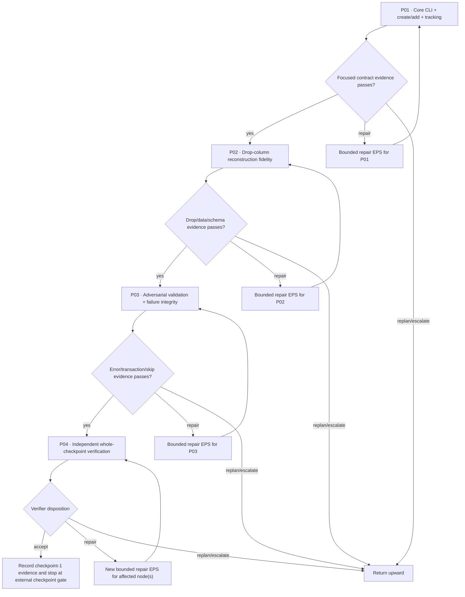

# Durable Phase Execution Graph

Main owns this topology. The initial EPS materializes all four currently executable nodes. They are serial because they share the same canonical implementation surface and each downstream node depends on evidence from the prior node.

## Graph

## Node contract

| Node | Primary outcome | Depends on | Owner | Reads | Writes | Evidence target | Gate |
|---|---|---|---|---|---|---|---|
| P01 | Implement runnable CLI foundation, schema validation, `_migrations`, `create_table`, `add_column`, JSONL/error behavior | — | Codex Orchestrator | `TASK.md`, `CHECKPOINTS/01.md`, checkpoint state | `migration_tool.py`; optional focused tests; Phase evidence/logs | create/add/skip smoke evidence and schema introspection | focused correctness |
| P02 | Implement/repair recreate-based `drop_column` with remaining-schema and row-data preservation | P01 | Codex Orchestrator | P01 code/evidence; SQLite schema | same canonical implementation/tests; Phase evidence/logs | valid drop preserves rows/schema; forbidden drops fail cleanly | schema/data fidelity |
| P03 | Harden contract validation, ordered multi-op failure integrity, SQL error handling, skip semantics, identifier/default edges | P02 | Codex Orchestrator | integrated code + P01/P02 evidence | same canonical implementation/tests; Phase evidence/logs | adversarial success/failure matrix with no false migration record | failure integrity |
| P04 | Fresh final verification of the complete revealed checkpoint, integrate bounded repairs if needed, record verifier disposition | P03 | Codex Orchestrator acting as verifier | full diff, all prior evidence, task/checkpoint | tests only if needed for verification/repair; Phase reports/evidence/state | representative end-to-end pass/fail evidence; clean scope; accept/repair/replan/escalate | whole-Phase gate |

## EPS realization

- EPS: `eps_001_initial` contains `P01 → P02 → P03 → P04` and distinct prompt files for every node.
- Requested route for every model node: Codex CLI / `gpt-5.6-terra` / `xhigh`. Each prompt is already Main-tailored to that surface; Orchestrator must validate and may make execution-local wording adjustments without changing outcome, dependencies, evidence, or authority.
- Record the exact product-visible model and effort at actual launch; do not silently substitute.
- No parallel subagents are authorized in the initial graph because all nodes share `migration_tool.py` and are naturally sequential. Read-only helper analysis is unnecessary for this small repository.

## Evidence gates and repair semantics

At each gate, inspect actual diff, actual wrapper-run commands/output, SQLite schema/data state, and caveats. A prompt completion without evidence is not integration. Recoverable defects use a **new** bounded EPS attempt under this unchanged DIC, preserving failed/superseded attempts and rerunning only affected checks plus necessary downstream verification. Material acceptance/scope changes are not local repairs.

A required environment-wrapper failure is handled exactly once by retrying the same command and preserving both outputs. It is not a permission gate. Continue independent repository work and escalate only if the repeated failure blocks a current acceptance criterion.

## External checkpoint gate

P04 acceptance closes only the currently revealed checkpoint-1 work. Do not infer later requirements. If the harness later changes `.evaluation/CHECKPOINT_STATE.json` to reveal another checkpoint, the surviving executor must first read that newly revealed checkpoint and recover durable state before any new implementation; until that reveal, no future-checkpoint action is authorized.

## Material stops

- changed Goal or checkpoint acceptance semantics;
- contradiction between root task and the currently revealed checkpoint that cannot be resolved conservatively;
- required destructive/external action, credentials/private system, public release, or paid resource;
- repeated failure of a required `run_in_env.py` command that makes a current acceptance criterion impossible.
